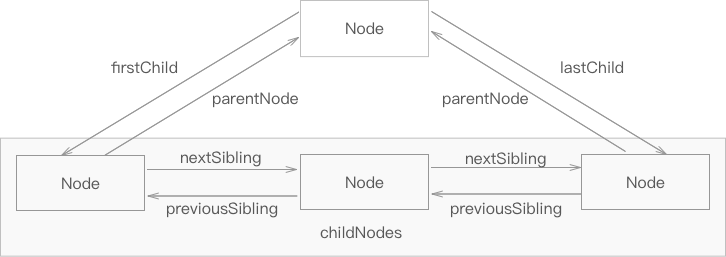
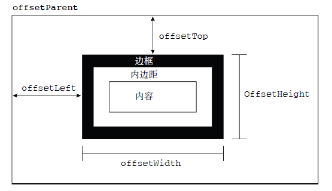
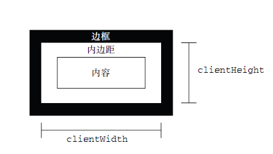
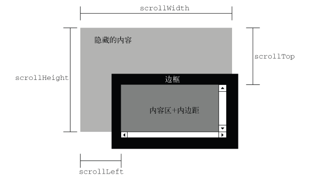

# 解释顺序

HTML 元素是按其在页面中出现的次序调用的，即先加载头部的 JavaScript 的脚本，再加载HTML 内部的脚步。如果 JavaScript 操作 [文档对象模型](https://developer.mozilla.org/zh-CN/docs/Web/API/Document_Object_Model) DOM 前 HTML DOM 未加载完，将出现错误。


## 行内操作 DOM

如果在 HTML 头部加载或行内 JavaScript 代码，需用 DOMContentLoaded 等待 DOM 加载完：

```javascript
<script>
document.addEventListener("DOMContentLoaded", function () {
    var internalJS = document.querySelectorAll('button');
    console.log(internalJS); // 如果不使用 DOMContentLoaded 事件。此处将无法获取到DOM元素，因为JS代码在头部尚未完全加载 HTML DOM 前进行了操作。
});
</script>
```

## 外部加载操作 DOM

使用 async 属性异步加载或  defer 属性延迟加载（延迟到文档完全被解析和显示后再执行），才可以操作 DOM。注意：这两个属性只对外部脚本有效。

```javascript
<script src="js/enqoo.js" async ></script>
```


还可以使用 DOMContentLoaded 事件包含要操作 DOM 的脚本。以及外部脚步放在 HTML 底部加载操作 DOM。

参照：[What is JavaScript? - Learn web development | MDN](https://developer.mozilla.org/en-US/docs/Learn/JavaScript/First_steps/What_is_JavaScript#how_do_you_add_javascript_to_your_page)

# 变量

变量可以保存任何值，以及对象属性，对象方法

```javascript
var a;        / /未赋值，变量的类型就是 undefined
var myObject = {};    // 变量保存对象
var myfun = function();       //变量保存函数
var myarray = [];          // 变量保存数组
```

变量未初始化时，值就是underfined 。

## 基本类型值

### String

- ECMAScript 中双引号和单引号的表示的字符串完全相同。
- 字符字面量（转义序列）：如：\n 换行， \t 制表， \b 空格  ......
- 字符串一旦创建，值就不可改变。要改变，先要销毁原来的字符串。

#### 转换方法

```javascript
// toString 转换字符串方法。数组、布尔值、对象和字符串值都有toString()方法。
var age = 11;
console.log(age.toString()); // 字符串"11"

// toString()转化数值时可以传入一个基数函数
var num = 120;
console.log(num.toString(2));

// null 和 undefined 值没有toString()方法
var isNull = null;
//console.log(isNull.toString());

// 在不知道null或undefined的情况下,可以使用转型函数String()
console.log(String(isNull));
```

### String 类型

逻辑上讲, 基本类型不应该有方法，因为它不是对象。但当读取一个基本类型，后台就创建了一个基本包装类型对象，从而能使用方法。

单基本包装类型的对象，只存于一行代码的瞬间，然后立即销毁。

```javascript
var s1 = "基本类型字符串";
var s2 = s1.substring(2); //调用现有方法
console.log(s2);
```

ECMAScript 提供3个特殊的引用类型：String, Boolean, Boolean

```javascript
s1.color = "不能在运行时给基本类型值增加属性和方法";
console.log(s1.color); //undefined 
```

#### 字符方法

```javascript
var stringObject = "hello world";

// charAt()返回字符方法,基于0的字符位置
console.log(stringObject.charAt(1)); //e

// charCodeAt(), 返回字符编码
console.log(stringObject.charCodeAt(1)); // 101

// ECMAScript5定义的,方括号加数字索引访问特定字符
console.log(stringObject[1]); //e

// concat()字符串拼接方法。实践中更多用"+"号拼接
console.log(stringObject.concat(' enqoo'));
console.log(stringObject.concat(' enqoo', ' 2016')); //可拼接任意字符串

//原来的字符串并未改变
console.log(stringObject); // hello world
```

#### 操作方法

```javascript
//slice() 和 substring() ,第一个参数指定字符串开始位置,第二个参数表示结束位置.
console.log(stringObject.slice(3)); //lo world
//负数情况下, 传入的负值与字符串长度相加
console.log(stringObject.slice(-3)); //rld 11+(-3)=8

console.log(stringObject.substring(3)); //lo world
//负数情况下,substring()将所有负值转化为0
console.log(stringObject.substring(-3)); //hello world

// substr() 第二个参数表示字符个数
console.log(stringObject.substr(3)); //lo world
console.log(stringObject.substr(-3)); //rld
console.log(stringObject.substr(3, 5)); //lo wo

//第二个参数还可以为负
console.log(stringObject.substring(3, -4));
console.log(stringObject.slice(3, -4));
console.log(stringObject.substr(3, -4));
```

#### 位置方法

```javascript
// 字符串位置查找方法
// indexOf(): 从字符串开始搜索。第二参数指定的位置向后搜索, 忽略该位置之前的所有字符。如果不存在，则返回 -1
console.log(stringObject.indexOf("o")); // 4
console.log(stringObject.indexOf("o", 6)); //7

// lastIndexOf(): 从字符串末尾向前搜索出现最后出现的位置。第二参数指定的位置向前搜索,忽略该位置之后的所有字符
console.log(stringObject.lastIndexOf("o")); // 7
console.log(stringObject.lastIndexOf("o", 6)); //4 从前的第四个位置

// https://developer.mozilla.org/zh-CN/docs/Web/JavaScript/Reference/Global_Objects/String/indexOf
```

#### 字符串模式匹配方法

```javascript
//match(),与pattern.exec(text)相同。接受一个参数:正则表达式或RegExp对象
var matches2 = text.match(pattern);
console.log(matches2); //["Foo"]
console.log(matches2[0]);
console.log(matches2.lastIndexOf()); // -1

//search()方法: 返回字符串第一个匹配模式的索引
var searchString = "cat, bat, sat, fat";
console.log(searchString.search(/at/)); //1

//search()方法: 替换子字符串
console.log(searchString.replace("at", "ond")); // cond, bat, sat, fat

//split(): 以分隔符分割多个字符串
console.log(searchString.split(",")); //["cat", " bat", " sat", " fat"]
console.log(searchString.split(",", 2)); //["cat", " bat"]
```

### Boolean

- true 和 false区分大小写。
- true不一定等于1，false不一定等于0。

#### 转化Boolean用Boolean() 函数

```javascript
//转化字符串
var isString = "这是个字符串";
console.log(Boolean(isString)); //true, 任何非空字符串


// 转化数值
var isNumber = '2';
var isNumer0 = NaN;
console.log(Boolean(isNumber)); //true
console.log(Boolean(isNumer0)); //0 或NaN为false

// 转化对象
var isObject = {};
console.log(Boolean(isObject)); //true, 对象null为false     
```

### Number

NaN（非数值）

#### 转换函数

```javascript
// Number() 转换函数, 注意此函数第一个字母大写,否则会出错
console.log(Number("hello")); //Nan
console.log(Number("")); //0
console.log(Number("000011")); //11
console.log(Number("true")); //NaN

//  parseInt()函数, 转换成整数。 较多使用此函数
console.log(parseInt("hello")); //NaN
console.log(parseInt("")); //NaN
console.log(parseInt("123hello")); //123
console.log(parseInt("22.33")); //22
console.log(parseInt("070")); //70 解析八进制时, ECMAScript 3是56, ECMAScript 5 是70
console.log(parseInt("070", 8)); //56 可指定第二个参数,转化使用的基数(进制)
console.log(parseInt("0xf")); //15 (十六进制数)
console.log(parseInt("AF", 16)); //175 第二个参数为16进制,可不带Ox

// parseFloat()函数,从第一个位置(0)开始解析每个字符串。
console.log(parseFloat('1234hello')); //1234
console.log(parseFloat('22.333')); //22.333
console.log(parseFloat('0022.333.6')); //22.333 始终会忽略前导的零
```

#### Undefined

声明变量var未初始化时，这个变量的值就是：undefined

对未声明和未初始化的变量执行typeof  操作符都会返回underfined：

```javascript
var message; //声明为初始化
console.log(typeof message); //undefined
console.log(typeof age); // 变量未声明, 也返回undefined
```

#### Null

空对象指针

## 引用类型

### RegExp（正则表达式）

正则表达式（英语：Regular Expression，在代码中常简写为regex、regexp或RE）使用单个字符串来描述、匹配一系列符合某个句法规则的字符串搜索模式。搜索模式可用于文本搜索和文本替换。

#### 创建正则表达式

**一、字面量形式:**
var expression = / pattern / flags;
模式(pattern)可以包含字符类、限定符、分组、向前查找及反向引用等任何简单复杂的正则表达式
标志(flags):

- g: 全局模式
- i: 不区分大小写
- m: 多行模式

```javascript
var pattern1 = /\[bc\]at/i; // 匹配第一个[bc]at,不区分大小写
```

**二、造函数模式:**

```javascript
//  构造函数模式
var pattern2 = new RegExp("\\[bc\\]at", "i"); //注意:两个参数都是字符串形式。需双重转义
//匹配元字符([{\^$|)?*+.]}都必须转义
```

#### RegExp实例属性

```javascript
/*-----  RegExp 实例属性。用处不大,模式直接反应相关信息  ----*/

//global属性:是否设置了g标志
console.log(pattern1.global); // false;
//是否设置了i标志
console.log(pattern1.ignoreCase); //true;

//是否设置了m标志
console.log(pattern1.multiline); //false

// 开始搜索下一个匹配项的字符位置,从0算起
console.log(pattern1.lastIndex); // 0

//正则表达式的字符串表示
console.log(pattern1.source); // "\[bc\]at"
console.log(pattern2.source); // "\[bc\]at"
```

#### RegExp实例方法

```javascript
//exec()方法:接收一个要匹配字符串参数,返回Array实例数组。该数组有两个属性,index 和input
var text = "aFooter";
var pattern = /(foo)/gi; // 匹配foo,不区分大小写
var matches = pattern.exec(text);
console.log(matches);// ["Foo", "Foo", index: 0, input: "footer."]
console.log(matches[0]); // 返回数组第一项 Foo
console.log(matches[1]); // 返回数组第二项 Foo
console.log(matches[3]); // undefined
console.log(matches.index);// 1 匹配项的位置
console.log(matches.input);// aFooter 要应用的字符串
```

```javascript
//test()方法: 是否与目标字符串匹配,接受一个字符串参数。返回true 或false
var text = "000-00-0000";
var pattern = /\d{3}-\d{2}-\d{4}/; // \d 为查找数字, \d{3} 匹配包含3个数字的字符串
if (pattern.test(text)){
    console.log('填写数字序列信息正确');
}
```

```javascript
//继承toString()、toLocaleString():返回正则表达式的字面量
var patternString = new RegExp("\\[bc\\]at", 'gi');
console.log(patternString.toString()); //   /\[bc\]at/gi
console.log(patternString.toLocaleString()); //  /\[bc\]at/gi

//继承valueOf()方法: 返回正则表达式本身
console.log(patternString.valueOf());
console.log(patternString.valueOf() instanceof RegExp); //true
```

# 函数

每个函数Function类型的实例，与其他引用类型一样具有属性和方法。由于函数是对象，因此函数名实际也是一个指向函数对象的指针，不会与某个函数绑定。

函数是第一类对象，意味着函数可以像对象一样按照第一类管理被使用。

Functions 是一种封装你想重复使用的功能的方法，这样你就可以在任何时候想使用其中的功能就通过函数名称来调用而不用老是重复写下整段代码。

## 定义函数

### 一：函数声明

```javascript
//声明一个函数
function sum(num1, num2){
    return num1 + num2;
}
sum(1, 2); // 放在语句前后都可以，因为函数声明进行了提升

 //声明一个匿名函数  
function() { }

function fun5() {  
    return function() { //返回一个匿名函数  
    }  
} 
```

### 二、函数表达式

```javascript
//声明一个变量指向一个匿名的函数表达式  
var sum  =  function (num1, num2){
    return num1 + num2;
};
// 调用函数
sum(1, 2);   //3

 //声明一个变量指向一个非匿名的函数表达式  
var fun1 = function fun() {
    alert(typeof fun); //  function, 该函数名只在函数体内部有效，在函数体外部无效
};
fun1();  // 记住，函数名只是指针，fun1变量覆盖了fun
```

## 函数名

函数名本身是变量，是指针，具有动态性。

```javascript
// 函数名仅仅是一个包含指针的变量而已。所以, 一个函数可以有多个名字, 如同变量复制基本类型值
function sum(num1, num2) {
  return num1 + num2;
}
var anotherSum = sum; // 使用不带圆括号的函数名是访问函数指针，而非调用函数
alert(anotherSum(10, 10)); //20

sum = null;
alert(anotherSum(10, 10)); //20
```

## 函数调用

### return 语句

可以把函数赋值给变量和对象的属性，也可以当作参数传入其他函数，或者作为函数的结果返回。函数只是一个可以执行的值，此外并无特殊之处。

如果一个函数中没有使用return语句，则它默认返回**undefined**。要想返回一个特定的值，则函数必须使用 return 语句来指定一个要返回的值。(使用new关键字调用一个构造函数除外)。

```javascript
// 将函数作为参数和返回值
function add(x, y) {
  return x + y;  // 圆括号之中，可以加入函数的参数。
  // return语句不是必需的，如果没有的话，该函数就不返回任何值，或者说返回undefined
}
add(1, 1) // 2 调用函数时，要使用圆括号运算符。

// 没有参数的情况下，返回值：
var myVar = function();

// 即使不把它保存为变量，您也可以使用返回值：
document.getElementById("demo").innerHTML=myFunction()
```

###递归函数

调用自身的函数我们称之为递归函数(recursive function)。在某种意义上说，递归近似于循环。

```javascript
function loop(x) {
  if ( x >= 3){
    return;
  }
  var loops = loop (x + 1);
// 如果一个函数中没有使用return语句，则它默认返回 undefined。要想返回一个特定的值，则函数必须使用 return 语句来指定一个要返回的值。(使用new关键字调用一个构造函数除外)。
  console.log(loops); // undefined
}
loop(0);
```

## 立即执行函数

当函数只使用一次时，通常使用IIFE (Immediately Invokable Function Expressions)，函数声明后立即调用的函数表达式。

```javascript
// IIFE 第一种形式，从函数声明推
// 函数表达式赋值给变量
var count = function () {};
// 函数表达式执行
count();
//  函数声明
function sum(param) { }
//  值传递。变量当参数传递给函数声明。变量只不过是值的另一种形式而已。
sum(count);
// 等价：
sum( function(){}() );
// 去掉函数名，匿名函数, 括号包含
( function(){}() );

// IIFE 第二种形式，从函数表达式推
// 执行函数表达式
count();
// 值传递，传入匿名函数
count( function (){} );
// 匿名函数直接执行，括号最后
( function(){} )();

// IIFE 可接受参数
( function (x,y){
  var result =  x + y;
  alert(result);
} )(5,2);
```

额外阅读：https://developer.mozilla.org/zh-CN/docs/Glossary/Function
https://goddyzhao.tumblr.com/post/11273713920/functions

立即执行函数不能替代 onload：https://segmentfault.com/q/1010000000524008

### 递归

函数调用自身。见底下阶乘函数。

## 作用域

所有变量（包括基本类型和引用类型）都存在一个执行环境中（作用域），这个执行环境决定了变量的生命周期，以及哪一部分代码可以访问其中的变量。

－执行环境有全局执行环境（全局环境）和函数执行环境之分；

－每次进入一个新执行环境，都会创建一个用于搜索变量和函数的作用域链；

－函数的局部环境可以访问函数作用域中的变量和其包含（父）环境，乃至全局环境；

－全局环境只能访问全局环境中的变量和函数，无法访问局部中的任何数据；

－变量的执行环境有助于确定应该何时释放内存。

```javascript
// 在Web浏览器中,全局执行环境被认为window对象。所有全局变量和函数都是作为windows对象和方法创建的。

// 全局环境和变量
var globalVar = "全局环境变量";

// 执行环境定义了变量或函数有权访问的其它数据，决定了它们各自的行为。每个环境都有使之关联的变量对象，环境中定义的变量和函数都保持在这个对象中。
// 局部变量 （环境中定义的所有变量和函数都保存在 变量对象 中）
function localFun() {
    var localVar = "localFun局部环境的变量";

//    局部环境
        function inLocalFun() {
            var inlocalVar = globalVar; //能访问全局变量
            console.log(inlocalVar);
            inlocalVar = localVar; // 能访问局部变量localVar 以及本函数变量inlocalVar
            console.log(inlocalVar);
        }
        inLocalFun();

    console.log(globalVar); //能访问全局变量
    console.log(localVar); //能访问localVar局部变量

    var visitInLocalVar = inlocalVar;
    console.log(visitInLocalVar); //不能访问inLocalFun函数中的inlocalVar的变量。
    // 环境之间只能向上搜索作用域链, 以查询变量和函数名。此处因不能找到该作用域的变量,会一直寻找变量
}
localFun();
//此处只能访问globalVar
```

### 延长作用域链

```javascript
    function buildUrl() {
        var qs = "?debug=true";

        with (location){ //location 对象
            var url = href + qs; //href 实际引用
        }
        console.log(url);
        return url; // 外部能访问with语句内的变量,延长作用域链
    }
    buildUrl();
```

### 没有块级作用域

```javascript
if(true){
  var color = "blue"; //if语句中的变量增加到当前执行环境中(这里的全局环境中,所以外部能访问到此变量)。
} // 在其它类C的语言中, 由花括号封闭的代码(块级作用域)在执行完if、for语句被销毁,即外部没有该变量

console.log(color); // blue
```

### 模仿块级作用域

```javascript
// 没有块级作用域的写法
function outputNum(count) {
    for (var i =0; i < count; i++){
        console.log(i); //0,1,2,3,4
    }
    console.log(i);  // 5 可以访问for循环的变量
}
outputNum(5);

// 函数表达式的块级作用域(私有作用域)
(function () {
    //块级作用域
})(); // 相当把匿名函数付给一个变量,然后调用变量加圆括号

function outputNum2(count) {
    (function () {
        for (var i =0; i < count; i++){
            console.log(i); //0,1,2,3,4
        }
    })();
    var i = "私有变量"; // 私有变量包括函数的参数、局部变量和函数内部定义的其他函数
    console.log(i);  // 无法访问for循环的变量
}
outputNum2(5);
```

### 没有重载

两个相同名字的函数，后面的会覆盖前面的

## 函数内部属性

### 函数参数

- 参数实际上是函数的局部变量。

```javascript
//  ---- 参数 num 为函数局部变量 -----
    function foo(num) {
        num = 40;
        num += 10;
        return num;
    }
    // 执行后无法访问参数 num, 因为此时 num 为参数局部变量
    foo();
    console.log(num); // num is not defined

//  ---- 函数中的变量变为全局时，执行后外部可访问；加 var 变局部变量时，函数外部无法访问 -----
    function foo2() {
        var num2 = 40;
        num2 += 10;
        return num2;
    }
    // 执行后无法访问参数 num
    foo2();
    console.log(num2); // 50
```

- 所有的函数参数都是按值传递的。函数外部的值复制给函数内部参数，就等于把值从一个变量复制到另一个变量一样。
- 基本类型的传递如同基本类型变量复制一样， 引用类型的传递，如引用类型变量的复制一样。参考上节动态的属性。

```javascript
//------ 基本类型例子 ------

        //参数命名只是提供便利, 非必需的。函数参数为局部变量
        function fun1(arg1, arg2, arg3) {
            console.log("参数个数: " + arguments.length);
            console.log(arguments[0] + arg2 + arg3);// 可通过arguments对象访问参数, 及和命名参数一块使用
        }

        function myFun(arg4) {
            alert('把此函数当参数传递');
        };

        fun1(1, 2); //参数个数2, 此时不能计算arg1 + arg2 + arg3,返回NaN, 因为没有传递值的命名参数将自动被赋予underfined值, 同变量未初始化。需添加第三个参数, 如下
        fun1(1, 2, myFun); //参数个数3, 计算结果: 3function myFun() { alert('把此函数当参数传递'); }
        fun1(1, 2, 3, 4);//参数个数4, 计算为6。 函数不介意传递多少参数, 参数内部用的是一个数组(arguments对象访问)来表示, 是以一个包含零个或多个值的数组形式传递的。

//--------引用类型例子 -------

        var person = new Object();

        function setName(obj) {
            console.log(obj); // Object() , obj为局部对象,在函数执行完毕立即销毁。
            obj.name = "函数内部按值引用";
            obj2 = new Object();
            obj2.name = '建一个新对象,复制给obj';
            obj2 = obj; //如果参数按引用传递, 如同引用类型复制值一样, 外部 person.name 应该反应 obj2.name 的值。事实上,没反应。
        }
        setName(person);
        console.log(person.name); //函数内部按值引用

        person.name = "函数外部重新赋予值";
        console.log(person.name); //函数外部重新赋予值
```

参考：https://developer.mozilla.org/zh-CN/docs/Web/JavaScript/Reference/Functions

### 把函数当参数传递

```javascript
function add(num) {
    return num + 10;
}

// 定义个通用函数
function callFun(someFun, someArg) { //someFun 为局部变量, 被传递 function add(num) { return num + 10; }
    console.log(someFun);  // function add(num) { return num + 10; }
    return someFun(someArg);// 此处相当于var someFun = function add10(num) { return num + 10; }, 通过someFun(someArg)给函数传入值
}

var result = callFun(add, 10); // 访问函数指针而不执行函数的话, 必须去掉函数名后面的圆括号

console.log(result); //20
```

### arguments对象

类数组对象，包含传入函数的所有参数。

有个callee属性指针，指向用于这个arguments对象的函数。

https://developer.mozilla.org/zh-CN/docs/Web/JavaScript/Guide/Functions#作用域和函数堆栈(Scope_and_Function_stack)

```javascript
        //        "use strict";

        //阶乘函数
        function fac(num) {
            if (num <=1){
                return 1;
            } else {
                return num * fac(num-1); // 函数执行和函数名fac 紧紧耦合一起,如果修改了函数名,就不怎么灵活了。
            }
        }

        //        var anotherFac = fac;
        //        fac = null;
        //        console.log(fac(5)); // 出错

        // 改进版
        function fac(num) {
            if (num <=1){
                return 1;
            } else {
                return num * arguments.callee(num-1); // 使用arguments.callee属性指向该函数,不管函数使用什么名,都保证正常完成递归调用

            }
        }

        // 严格模式下, arguments.callee会导致错误。可利用函数表达式, 严格非严格模式都行得通。
        var fac = (function f(num) {
            if (num <=1){
                return 1;
            } else {
                return num * fac(num-1);
            }
        }); //此处加不加()一样的效果

        //  进行传递
        var trueFac = fac;     //arguments.callee指向此函数, fac函数名只是指针
        fac = function () { return 0; };  //如果不使用,这里重置了fac函数

        console.log(trueFac(5)); // 120 如果不使用arguments.callee, 会返回0 
        console.log(fac(5)); //0
```

### this 对象

```javascript
// this引用函数据以执行的环境对象

window.globalVar = "网页的全局作用域中调用函数时,this对象引用的就是window";
var globalObject = { globalVar: "全局对象中的方法"};
function sayVar() {
    console.log(this.globalVar); // this引用全局 window.globalVar
}

sayVar(); // 返回windows中的对象

// 函数去掉花括号为引用函数,非调用
globalObject.sayOther = sayVar; //globalObject对象增加一个方法,引用sayVar 函数, 相当 globalObject.sayOther = function sayVar() { ... }

//请记住, 函数名是一个包含指针的变量而已。全局的sayVar() 和 globalObject.sayOther 指向同一个函数。
globalObject.sayOther(); // 返回globalObject中的变量值
```

### caller属性

```javascript
//caller属性保存着当前函数被引用的函数。Opera早期版本不支持此属性.
function outer() {
  inner();
}

function inner() {
  console.log(inner.caller);  //当前引用inner函数的函数: function outer() { inner(); }
  // 此次可改arguments.callee.caller;
}

outer();
```

## 函数属性和方法

函数即对象，可以直接加属性和方法。 

https://zh.javascript.info/function-object#zi-ding-yi-shu-xing

```javascript
function Enqoo(){}

Enqoo.add = 'design'
Enqoo.action = function(){}
```

### length

```javascript
function funNum(arg1, arg2) {
  console.log("length计算函数接收的命名参数的个数")
}
console.log(funNum.length); //2
```

### call() 和 apply() 方法

```javascript
// 两个方法在特定作用域内调用函数
// apply() 方法
function sum(num1, num2) {
    return num1 + num2;
}
function applySum1(num1, num2) { // 此处参数可有可无
    return sum.apply(this, arguments);
// 此处this 对于 windows 对象(在全局环境中,this等于window, 当函数被作为某个对象的方法调用时, this等于那个对象)
}
//参数一设置作用域, 参数二为参数数组,可以是Array实例和arguments对象。
function applySum2(num1, num2) {
    return sum.apply(this, [num1, num2]); 
}
console.log(applySum1(1, 2)); // 3
console.log(applySum2(1, 2)); // 3

//call() 方法, 第一个参数相同,第二个参数需逐个列出
function callSum1(num1, num2) {
    return sum.call(this, num1, num2);
}
console.log(callSum1(1, 2)); // 3

// 扩充函数懒于运行的作用域
window.color = "默认全局作用域, window对象";
var o = {color: "定义一个全局变量"};

function sayColor() {
    console.log(this.color);// 默认调用全局window对象中的color
}
sayColor(); // 默认全局作用域, window对象
sayColor.call(this); // 默认全局作用域, window对象
sayColor.call(window);// 默认全局作用域, window对象
sayColor.call(o); // 定义一个全局变量

//ECMAScript 5: bind()方法, 创建一个函数的实例
var objectSayColor = sayColor.bind(o);
objectSayColor(); //定义一个全局变量
```

## 闭包

```javascript
// 闭包是指有权访问另一个函数作用域中的变量的函数
function outFun() {
    var name = "Enqoo";
    function inFun() {
        console.log(name); // 访问inFun函数外的变量
    }
    inFun(); // 直接执行内部函数
}
outFun(); //Enqoo

// 等同下面
function outFun() {
    var name = "Enqoo";
    function inFun() {
        console.log(name); // 访问inFun函数外的变量
    }
    return inFun;  //访问函数指针, inFun 作为整体函数返回:  function inFun() { console.log(name);
}
var myFun = outFun(); //把返回的函数赋予变量
myFun();//Enqoo
```

https://developer.mozilla.org/zh-CN/docs/Web/JavaScript/Closures

### 闭包与匿名函数

```javascript
// 闭包携带包含它的函数作用域。会占用过多内存，建议少用。
// 本地活动对象:arguments 和 propertyName 及全局变量对象:compare 和 result
function outFun(propertyName) {
    // 一般来讲,当函数执行完毕后,局部活动对象就会销毁,内存中仅保存全局作用域。但闭包有所不同
    // 闭包活动对象包含:本身的:arguments、object1、object2 和 outFun 的活动对象及全局变量对象。
    // 作用域链被初始化 outFun()函数, 所以匿名函数可以访问outFun()定义的所有变量对象
    return function(object1, object2) {  // 能够创建函数再赋值给变量 ，也就是能够把函数作为其它函数的值返回。返回的函数可能会被赋值给一个变量，或以其他非方式被调用。此处返回一个匿名函数。把函数当值用的时候，都可以使用匿名函数。
        console.log(object1); //{name: "hello"}
        console.log(object1.name); //hello 为什么能这样调用? 因为所有的函数参数都是按值传递的。函数外部的值复制给函数内部参数,就等于把值从一个变量复制到另一个变量一样。
//      参数为局部变量, 此处相当于函数外部新建一个对象, object1参数和该对象引用同一个对象(只不过字面量{name: "hello"}为匿名对象而已)。参考传递参数那节
//
        var value1 = object1[propertyName]; // 使用方括号表示法来取得给定属性的值, 方括号可以通过变量访问
        var value2 = object2[propertyName]; // propertyName 为outFun中的参数, 此处用作变量属性
        if(value1 < value2){
            return -1;
        } else if(value1 > value2){
            return 1;
        }else{
            return 0;
        }
    };
}

var compare = outFun("name");

console.log(compare);  /* 返回: function (object1, object2) {
 var value1 = object1[propertyName];
 var value2 = object2[propertyName];
 if(value1 < value2){
 return -1;
 } */

var result = compare({name: "hello"}, {name: "Greg"});

console.log(result); // 1

// 解除对匿名函数的引用
compare = null;
console.log(compare); // null
```

### this 对象 与 that

```javascript
var name = "全局 window 中的 name";
    var object = {
        name: "对象中的name",
        getNameFun: function () {
          //  匿名函数的执行环境具有全局性，this 对象通常指向 window
            return function () {
                return this.name;
            }
        }
    };
   // 内部函数只搜索到活动对象为止，此处匿名往上搜索一级即 window
    console.log(object.getNameFun()()); //  全局 window 中的 name

    var name = "全局 window 中的 name";
    var object = {
        name: "对象中的name",
        getNameFun: function () {
            var that = this; // 把外部作用域中的 this 对象保持在一个闭包能够访问到的变量理，就可以让闭包访问该对象了
            return function () {
                return that.name; // 正常访问对象中的属性
            }
        }
    };
    console.log(object.getNameFun()()); //  对象中的 name


var dirObject = {
    name: "直接使用return 的例子",
    getName: function () {
        return this.name;
    }
};
console.log(dirObject.getName()); //直接使用return 的例子
//引用函数并执行
console.log((dirObject.getName)()); // 直接使用return 的例子
console.log((dirObject.getName = dirObject.getName)()); //The window
```

## 私有变量

私有变量：不能在函数外部访问, 私有变量包括函数的参数、局部变量和函数内部定义的其他函数

### 私有变量和特权方法

```javascript
// 创建私有变量的公有方法——特权方法(有权访问私有变量和私有函数的共有方法)

// 第一种方法: 使用构造函数在对象上创建特权方法。构造函数对象内部使用this使变量和方法能被外面访问到
function MyObject(name) {

    // 私有变量和私有函数
    var privateVar = 10;
    function privateFun() {
        return name;
    }
    //特权方法
    this.publicMethod = function() {
        privateVar;
        return privateFun();
    };

    this.setMethod = function(value) {
        name = value;
    };
}
//实例化
var pubObject = new MyObject("enqoo");
console.log(pubObject.privateVar); // undefined 无法直接访问私有变量
console.log(pubObject.publicMethod()); // enqoo 使用特权方法访问
pubObject.setMethod("hello");
console.log(pubObject.publicMethod()); // hello

// 第二种方法, 静态私有变量, 通过在私有作用域中定义私有变量或函数, 来创建特权方法
(function () {
//  私有变量和私有函数
    var privateVar = 10;
    function privateFun() {
        return false;
    }
//  构造函数
    MyObject = function () { // 此处未使用var关键字, 作为全局变量, 能够在私有作用域外被访问到。
//  记住: 初始化未经声明的变量,总是会创建一个全局变量。严格模式下, 给未经声明的变量赋值会导致错误。
    };

    MyObject.prototype.publicMethod = function () { //对象原型模式
        privateVar++;
        return privateFun();
    }
})();

(function () {
    var name = ""; //
    Person = function (value) { // 注意此处用函数表达式。函数声明只能创建局部函数。
        name = value;
    };

    Person.prototype.getName = function () {
        return name;
    };
    Person.prototype.setName = function (value) {
        name = value;
    };

})();
var person1 = new Person("hello");
console.log(person1.getName()); // hello
person1.setName("另外一个名字");
console.log(person1.getName()); // 另外一个名字

var person2 = new Person("enqoo");
console.log(person1.getName()); // enqoo
console.log(person2.getName()); //enqoo
```

### 模块模式

```javascript
// 模块模式: 为单例(只有一个实例的对象)创建私有变量和特权方法。按照惯例, 以对象字面量创建单例对象:
//var singleton = {
//    name: value,
//    method: function () {
//    }
//};

// 单例通常作为全局对象存在
var singleton = function() {
//  私有变量和私有函数
    var privateVar = 10;
    function privateFun() {
        return false;
    }

// 返回字面量对象, 值包含可以公开的属性和方法
    return {
        publicProperty: true,
        publicMethod : function() {
            privateVar++;
            return privateFun();
        }
    }
};
var sing = new singleton();
console.log(sing.publicProperty); //true
console.log(sing.publicMethod()); // false
```

### 增强的模块模式

```javascript
var application = function () {
//   私有变量
    var components = new Array();
//    初始化
    components.push(new BaseComponent());

// 创建application的一个局部副本
    var app = new BaseComponent();

//    公共接口
    app.getComponentCount = function () {
        return components.length;
    };
    app.registerComponent = function (component) {
        if ( typeof component == 'object'){}
        components.push(component);
    };
    return app;
}();
```

### 总结

1、对象中有属性和方法，属性相当于基本类型的变量，方法为函数。

2、函数也是对象，通过符号就可以看出来{}，外部不能访问函数类的var的变量(没有var 全局变量外部可以访问), 函数中的私有变量需要通过构造函数中定义特权方法进行访问。

3、用函数表达式创建匿名函数（拉姆函数）：var defaultFun = function(){};  默认空对象var defaultObj = {};

4、闭包是有权访问另一个函数作用域中的变量的函数,，上述特权方法也为闭包模式。

5、this对象, 在全局中,this等于windows, 当函数被作为对象的方法调用时, this等于那个对象。匿名函数(拉姆函数)的执行环境具有全局性（从返回的函数就可以出来）, 其this对象指向window

6、创建函数两种方式, 函数声明: function isFun() {} 或函数表达式: var isFun = function () {} 。两种方式都可以通过new 操作符实例化，或者在后面加括号执行 function () {} ()。**将声明转换表达式：( function () {// 这里是块级作用域} () )

# 事件

事件: JavaScript 与 HTML 之间的交互。可以使用侦听器(处理程序)来预订事件。用户或浏览器自身执行的某些动作,如click、load、mouseover,都是事件的名字。

事件处理程序(事件侦听器)：响应事件的函数。以"on"开头, 如onclick, onload

事件流: 从页面中接收事件的顺序

事件冒泡: IE的事件流, 从具体的元素(文档嵌套最深的那个节点),逐级向上传播到文档

事件捕获: Netscape提出的, 从不太具体的节点到最后具体的事件节点

优先使用事件冒泡, 特殊时使用事件捕获

DOM事件流(DOM2级事件规定): 首先是事件捕获阶段、然后是处于目标阶段，最后是事件冒泡阶段。捕获阶段不包含目标事件阶段的节点。

```html
<input type="button" value="点击我" onclick="alert('点击事件')" id="myBtn" />
<input type="button" value="调用函数" onclick="showMessage()" />
<input type="button" value="事件类型" onclick="alert(event.type)" />
<input type="button" value="事件的目标元素" onclick="alert(this.value)" />

<form method="post">
    <input type="text" name="username" value="">
    <input type="button" value="在文本框中输入点击" onclick="alert(username.value)">
</form>
```

## 事件处理程序的方式

### 一、HTML事件处理程序

```javascript
// 可以在HTML中定义动作,或写个脚本调用
    function showMessage() {
        alert("hello world");
}
```

### 二、DOM0级事件处理程序

每个元素(包括window和document)都有自己的事件处理程序属性，属性全部小写,如onclick。将这种属性设置为一个函数，就可以指定事件处理程序。使用DOM0级方法指定的事件处理程序被认为是元素的方法。这种方式增加的事件处理程序在事件流的冒泡阶段被处理。

```javascript
// 需要把这些代码放在按钮后面才能执行
    var btn = document.getElementById("myBtn");
    btn.onclick = function () {
        alert("元素的属性事件");
        alert(this.id); //this 引用当前元素
 };
```

### 三、DOM2 级事件处理程序

addEventListener("事件名", "处理事件函数", "true 或 false, true 捕获阶段调用事件处理程序, false为冒泡阶段调用事件处理程序")。可同时增加多个事件处理程序，按照增加顺序触发。

```javascript
btn.addEventListener("click", function () {
  alert(this.id);
}, false);

// 或
var handler = function () {
    alert("可以增加多个事件处理程序");
};
btn.addEventListener("click", handler, false);
```

IE9、Firefox、Safari、Chrome和Opera支持DOM2级事件处理程序。

### IE事件处理程序

增加多个处理程序时，以相反顺序触发。

```javascript
// attachEvent()可增加多个处理程序,但执行是相反的。
btn.attachEvent("onclick", function () { // 注意是onclick,不是click
  console.log("IE中的事件处理程序");
  console.log(this === this.window); //true
  // 在DOM0级事件处理程序在其所属元素的作用域中运行。在attachEven()方法中,则是全局作用域中运行,因此this等于window
});

// detachEvent(),移除事件处理程序
```

支持IE事件处理程序的浏览器有IE 和Opera。

### 移除事件处理程序

```javascript
btn.removeEventListener("click", handler, false); // 参数必须与addEventListener相同
```

## 事件对象

在触发DOM上的某个事件时(**即点击的元素，非选中的元素**。先是捕获，目标元素，再冒泡)，会产生一个事件对象event，包含所有与事件有关的信息（包括导致事件的元素、事件的类型以及其他特定事件相关）。

### DOM中的事件对象

DOM0级或DOM2，event对象传入事件处理程序中

```javascript
var btn = document.getElementById("myBtn");
btn.onclick = function(event){
  alert(event.type); // click
}

btn.addEventListener("click", function(event){
  alert(event.type); // click
},false)
```

### IE中的事件对象

IE中，使用DOM级方法增加事件处理程序时，event对象作为window对象的一个属性。如：

```javascript
var btn = document.getElementById("myBtn");
btn.onclick = functon(){
  var event = window.event;  // event对象作为window对象的一个属性
  alert(event.type) // click
}
```

如果是使用attachEvent()增加，event对象则作为参数传递（也可同window.event对象属性访问）：

```javascript
var btn = document.getElementById("myBtn");
btn.attachEvent("onlick", function(event){
  alert(event.type); // click
});
```

## 跨浏览器事件

```javascript
    // 跨浏览器事件处理程序和事件对象
    var EventUtil = {
        // 要操作的元素、事件名称、事件处理程序
        addHandler: function (element, type, handler) {
            if(element.addEventListener){ //首先检测传入的元素中是否存在DOM2级方法
                element.addEventListener(type, handler, false);
            } else if(element.attachEvent){ // IE 事件处理程序
                element.attachEvent("on" + type, handler);
            } else{
                element["on" + type] = handler; // DOM0级
            }
        },
        removeHandler: function (element, type, handler) {
            if(element.removeEventListener){
                element.removeEventListener(type, handler, false);
            } else if(element.detachEvent){
                element.detachEvent("on" + type, handler);
            } else{
                element["on" + type] = null;
            }
        },
        // 跨浏览器事件对象
        getEvent: function (event) {
          // ie中最佳方式通过window.event访问事件对象
            return event ? event : window.event; // 条件操作符
        },
          // 事件目标
        getTarget: function (event) {
            return event.target || event.srcElement;
        },
          // 取消事件默认行为,如链接
        preventDefault: function (event) {
            if (event.preventDefault){
                event.preventDefault();
            } else{
                event.returnValue = false;
            }
        },
          // 取消事件冒泡或捕获
        stopPropagation: function (event) {
            if (event.stopPropagation){
                event.stopPropagation();
            }else{
                event.cancelBubble = true;
            }
        },

        // 跨浏览器mouseover 和 mouseout 的相关元素
        // mouseover事件的主要目标是获得光标元素,相关元素为失去的光标。mouseout相反
        getRelatedTarget: function (event) {
            if(event.relatedTarget){
                return event.relatedTarget;
            } else if (event.toElement){ // IE中mouseout事件的相关属性toElement
                return event.toElement;
            } else if (event.fromElement){ //IE中mouseover事件的相关性属性fromElement
                return event.fromElement;
            } else {
                return null; // 其它事件中为null
            }
        },
        // 鼠标按钮
        getButton: function (event) {
            if(document.implementation.hasFeature("mouseEvents", "2.0")){
                return event.button;
            } else {
                // 把IE8中的鼠标按钮button属性规范成DOM的button属性
                switch (event.button){
                    case 0:
                    case 1:
                    case 3:
                    case 5:
                    case 7:
                        return 0; // 主鼠标按钮
                    case 2:
                    case 6:
                        return 2; // 此鼠标按钮
                    case 4:
                        return 1; // 中间鼠标按钮
                }
            }
        },
        // 鼠标滚轮：保持一致的浏览器滚轮取值
        // 检测 event 的wheelDelta属性。当向前滚轮，wheelDelta是120的倍数；向后滚轮，wheelDelta是-120的倍数。
        getWheelDelta: function (event) {
            if (event.wheelDelta){
                return event.wheelDelta;
                // 如果要检测opera 9.5 以下，此处换 (client.engine.opera && client.engine.opera < 9.5 ? -event.wheelDelta : event.wheelDelta);  需编写client检测浏览器对象
                // Opera 9.5之前,wheelDelta 值的正负号是颠倒的，client 对象检测了浏览器是不是早期版本的 Opera
            } else {
                return -event.detail * 40; // 在firefox中，有关鼠标滚轮的信息保存在detail属性中。向前是-3的倍数，向后是3的倍数。由于firefox的值有所不同，所以取反，再乘以40，保持滚轮数值一致。
            }
        },
        // 字符编码跨浏览器
        getCharCode: function (event) {
            // IE9、FF、chrome、safari支持
            if (typeof event.charCode == "number"){ // charCode, 按下键所代表字符的ASCII编码
                return event.charCode;
            } else {
                return event.keyCode; // IE8 和Opera 是在keyCode 中保存字符的ASCII编码
            }
        }
    };

    // 使用EventUtil 对象
    var handler = function () {
        alert("响应事件");
    };

    EventUtil.addHandler(btn, "click", handler);
    EventUtil.removeHandler(btn, "click", handler);

    // 滚轮使用
    // 把代码放在一个私有作用域中
    (function () {
        function handleMouseWheel(event) {
            event = EventUtil.getEvent(event);
            var delta = EventUtil.getWheelDelta(event);
            alert("滚轮的值:" + delta);
        }
        // 使用滚轮事件
        EventUtil.addHandler(document, "mousewheel", handleMouseWheel);
        // Firefox滚轮事件
        EventUtil.addHandler(window, "DOMMouseScroll", handleMouseWheel);

    })();
```

# 数组

ECMAScript数组与其它语言都是数据的有序列表，但ECMAScript 数组的每项都可以保存任何类型的数据，如第一个位置保存字符串，第二个位置保存数值，第三个位置保存对象，以此类推。且数组大小可动态调整，随着数据的增加自动增长容纳新增数据。

## 创建数组

### 一、Array构造函数

```javascript
var colors = new Array();  //可省略new操作符

// 直接在里面传递项，如果传递一个值，数字表示项数，字符串为项值。
var colors = new Array("red", "blue", "green");
var colorsNum = new Array(2, 3, 4);
console.log(colorsNum.length); //3

var colors = new Array(20); // 给数组设置项数，即length属性的值
```

### 二、数组字面量

```javascript
var colors = ["red", "blue", "green"]; 
var colors = []; // 创建空数组
```

## 数组访问

读取和设置数组的值时，使用方括号并提供相应的基于0的数字索引：

```javascript
//使用方括号［］访问、增加和修改数组项
var myArray =['hello', 22, "world"];
var emptyArray = [];
console.log(myArray[0]);//访问数组
myArray[2] = "修改第三项";
myArray[4] = "增加第四项";

// 数组的length(): 增加、减少、移除数组项。数组位置不存在显示undefined
// 减少至2项
myArray.length = 2;
console.log(myArray[3]); //undefined

// 增加至4项
myArray.length = 4;
console.log(myArray[3]); //undefined

// 利用length增加项
var myArray = ["hello", 22];
myArray[myArray.length] = "length属性在数组末尾增加新项";
console.log(myArray[2]); //length属性在数组末尾增加新项

myArray[99] = "增加100-1项";
console.log(myArray.length); // 100
```

## 检测数组

```javascript
// ECMAScript3 使用instanceof 操作符
if(value instanceof Array){
  // 对数组执行某些操作
}

// ECMAScript5新增 Array.isArray() 检测数组, IE9+、FireFox4+....等浏览器支持
var thisArray = [];
console.log(Array.isArray(thisArray)); //true
```

## 遍历数组

和遍历枚举对象一样，使用for-in 语句。

```javascript
var myArray = ['red','green','blue'];
for (var arrayName in myArray){
  document.write(arrayName + ' ');
  document.write(myArray[arrayName]+ '<br />');
  /* 输出：
  0 red
  1 green
  2 blue
  */
}
```

## 转换方法

```javascript
//数组为对象,同样具有toString()、toLocalString()、valueOf()方法
var colors = ["red", "blue", "green"];
console.log(colors.toString()); //red,blue,green
console.log(colors.valueOf()); // ["red", "blue", "green"]
console.log(colors); // ["red", "blue", "green"]

var people1 = {
    toLocaleString : function () {
        return "people1中的toLocaleString方法";
    },
    toString: function () {
        return "people1中的toString方法";
    }
};
var people2 = {
    toLocaleString : function () {
        return "people2中的toLocaleString方法";
    },
    toString: function () {
        return "people2中的toString方法";
    }
};
var people = [people1, people2]; // 表达式没有变量提升,此语句不能放在上面。

// alert()接受字符串, 会在后台调用toString() 方法
alert(people);  //people1中的toString方法,people2中的toString方法

console.log(people); //[Object, Object]
console.log(people.toString()); //people1中的toString方法,people2中的toString方法
console.log(people.toLocaleString()); // people1中的toLocaleString方法,people2中的toLocaleString方法

//可join()方法分割数组项
console.log(people.join("|"));   // people1中的toString方法|people2中的toString方法
```

## 数组项操作方法

```javascript
//push():把项增加在末尾,返回数组长度
var colors = new Array();
var count = colors.push("red", "green");
console.log(count); //2

count = colors.push("black");
colors[3] = "white"; //也可以使用数组方法增加项
console.log(count); //3
console.log(colors.length); //4

//pop(): 移除末尾最后一项, 返回移除的项
var item = colors.pop();
console.log(item); //black
console.log(colors.length); //2

// shift(): 取得数组的第一项并返回该项,及数组长度减1
var item2 = colors.shift();
console.log(item2); // red
console.log(colors.length); // 2
console.log(item2.length); // 3 red的3个字母长度

//unshift(): 在数组前增加任意个项,返回新数组的长度
var item3 = colors.unshift("yellow", "blue");
console.log(colors.length); //4
```

## 重排序方法

```javascript
// reverse(): 反转数组项的顺序
var value = [1, 2, 3, 4, 5];
console.log(value.reverse()); //[5, 4, 3, 2, 1]

// sort(): 调用toString()转型方法,比较字符串。生序排列数组, 最小的在前面, 最大的在后面。
var values = [0, 1, 5, 10, 15];

//字符串比较, "10"位于"5"前面
console.log(values.sort()); //[0, 1, 10, 15, 5]

// 定义一个函数比较, 交换返回值让更大的值排位靠前
function compare(value1, value2) {
    if(value1 < value2){
        return 1;
    } else if(value1 > value2){
        return -1;
    }else{
        return 0;
    }
}
values.sort(compare);

console.log(values); // [15, 10, 5, 1, 0]
```

## 操作方法

```javascript
// concat(): 拼接方法, 基于当前数组创建新的数组。此方法在字符串是拼接字符串。
var colors = ["red", "green", "blue"];
var colors2 = colors.concat("yellow", ["black", "brown"]);
console.log(colors2); //["red", "green", "blue", "yellow", "black", "brown"]
//alert(colors); // red,green,blue
//alert(colors2); // red,green,blue,yellow,black,brown

//slice(): 基于当前数组创建一个或多个项的新数组。同字符串操作方法一样, 一个参数起始位置,一个结束位置(不包括结束位置)
console.log(colors2.slice(1)); // ["green", "blue", "yellow", "black", "brown"]
console.log(colors2.slice(1, 3)); // ["green", "blue"]

// splice():向数组插入项,可以进行删除、插入、替换。参数为起始位置, 要删除的项和要插入的项
// 删除 前两项
var removed = colors.splice(0, 1);
console.log(colors); //["green", "blue"]
console.log(removed); //["red"] 返回删除的项

// 插入
var removed = colors.splice(1, 0, "yellow", "orange");
console.log(colors); // ["green", "yellow", "orange", "blue"]
console.log(removed); // 返回空数组,没有删除项

// 替换
var removed = colors.splice(1, 1, "red", "purple");
console.log(colors); // ["green", "red", "purple", "orange", "blue"]
console.log(removed); //["yellow"]
```

## 位置方法

```javascript
//indexOf()同字符串位置方法,参数一为查找的项的位置, 参数二可选的查找起点位置。没有找到返回-1
var numbers = [1, 2, 3, 4, 5, 4, 3, 2, 1];
console.log(numbers.indexOf(4)); //3 数字4在数组的第三项
console.log(numbers.lastIndexOf(2)); 7 // 2在从前面数的第七项
console.log(numbers.indexOf(4, 4)); // 从第四项开始搜索,找到第二个4
// // 支持浏览器IE9+、FF2+、Safari3+、Opera9.5、Chrome
```

## 迭代方法

```javascript
//every(),some(),filter(),map(),forEach(), 接受两个参数,要运行的函数和作用域对象
// 传入的函数接受三个参数:数组项的值、该项的位置、数组对象本身
// every(): 如果每一项都返回true,则返回true
var everyResult = numbers.every(function (item, index, array) {
    return (item > 2);
});
console.log(everyResult); // false

//some():其中的任一项返回true,则返回true
var someResult = numbers.some(function (item, index, array) {
    return (item > 2);
});
console.log(someResult); //true

// filter(): 返回包含的项组成数组
var filterResult = numbers.filter(function (item, index, array) {
    return (item > 2);
});
console.log(filterResult); //[3, 4, 5, 4, 3]

// map(): 返回原数组每项组成的新数组
var mapResult = numbers.map(function (item, index, array) {
    return item * 2;
});
console.log(mapResult); // [2, 4, 6, 8, 10, 8, 6, 4, 2]

//forEach(): 每一项运行函数,没有返回值。 和for的一样
numbers.forEach(function (item, index, array) {
    // 执行某些操作
});
// 支持浏览器IE9+、FF2+、Safari3+、Opera9.5、Chrome
```

## 归并方法

```javascript
var values = [1, 2, 3, 4, 5];

//reduce(), reduceRight(): 迭代数组所有项, 返回最终值
//函数参数: 前一个值、当前值、项的索引
var sum = values.reduce(function (prev, cur, index, array) {
    return prev + cur; 
    // 返回的任何值作为第一个参数自动传给下一项。第一次迭代发生在数组第二项, 因此第一个参数是数组的第一项,第二参数是数组的第二项
});
console.log(sum); // 15 
// 第一次执行回调函数,prev是1, cur是2。第二次,prev是3(1+2),cur是3(数组的第三项)。

//reduceRight(): 反向迭代
var sum = values.reduceRight(function (prev, cur, index, array) {
    return prev + cur;
});
console.log(sum); // 15     
```

# 对象

ECMA-262把对象定义为：<u>无序属性的集合，其属性可以包括基本值、对象或者函数</u>（属性被赋值基本值为对象属性，被赋值函数为对象方法）。对象的每个属性或方法都有一个名字，而每个名字都映射到一个值。我们可以把ECMAScript的对象想象成散列表：无非就是一组名值对，其中值可以是数据或函数。

对象，基本上 JavaScript 里的任何东西都是对象，而且都可以被储存在变量里。将这个记在脑子里。

## 对象定义

引用类型的值（对象）是引用类型的一个实例，类的实例就是对象。

每个对象基于一个引用类型（原生类型，如 Array类型、Date类型、Object类型...）创建，也可以是开发人员定义的类型。

```javascript
// 所有的对象都有下例属性和方法
var o = new Object();
o.name = "enqoo";

//constructor:保存创建当前对象的函数
console.log(o.constructor); // function Object(){ [native code] }

//hasOwnProperty(propertyname):检测给定的属性是否在当前对象中。参数名必需是字符串
console.log(o.hasOwnProperty("name")); //true

//isPrototypeOf(Object): 检查传入的对象是否是该对象的原型
console.log(o.isPrototypeOf(o)); // false

//propertyIsEnumerable(propertyname): 检查属性是否能够使用for-in语句来枚举。参数名必需是字符串
console.log(o.propertyIsEnumerable(name)); //false

//toString(): 返回对象的字符串表示。参数里可以填入一个基数,2、8、16进制
console.log(o.toString()); //[object Object]

//toString(): 返回对象的字符串表示,与执行环境的地区对应
console.log(o.toLocaleString()); //[object Object]

//valueOf: 返回对象的字符串、数值或布尔值表示
console.log(o.valueOf()); //Object {name: "enqoo"}
```

### 类

JavaScript可用方法作类。类定义相当于函数定义，。

```javascript
// 自定义构造函数（构造函数模式创建对象）
function Person() { }  // 注意第一个P大写
// 或
var Person = function(){ }

// 类实例化为对象
var person1 = new Person();
var person2 = new Person();
```

## 创建对象

### 一、对象字面量

```javascript
// 用变量加方括号
var myObject = {
   name: "enqoo",  //属性名可以用字符串: "name"
   year: 2011,
   details:{
     color: "red",
     job: "design"
   },
//对象方法。属性赋予函数即方法
  sayName: function(){
      alert(this.name); // 被解析成myObject.name
  }
}; //相当语句，末尾加分号;

//留空花括号, 定义默认属性和方法。和上面等价
var myObject = {};
myObject.name = "enqoo";  
myObject.year = 2011;

// 对象属性访问：可通过链式表示方法访问：
myObject.details.color
myObject["details"]["job"]

// 访问对象方法
myObject.sayName();
```

把对象字面量当参数传递

```javascript
//对象字面量当做参数传递
 function displayInfo(args) {
      console.log(args.name);
      console.log(args.year);
 }
 displayInfo({ //封装对象字面量
      name: 'enqoo',  
      year: 2011
 });
```

#### 对象访问

通过点或方括号［］访问属性：

```javascript
var name = "hello";
person[name]  //此方法可通过变量访问
person.name
```

遍历对象：

```javascript
var myObject = { name: 'desheng', age: '30', sex: 'man'};
for (var x in myObject){ // 遍历对象和数组方法
//   document.write(x);
     document.write(myObject[x]);
}
```

### 二、Object引用类型(Object原生构造函数)

使用Object构造函数创建对象，留意下列构造函数模式。

```javascript
var myObject = new Object(); 
//  对象属性
myObject.name = "enqoo";
myObject.year = 2011;

// 对象方法
myObject.sayName =  function(){
    alert(this.name); // 被解析成myObject.name
};
```

### 三、工厂模式

```javascript
// 工厂模式创建对象, 用函数封装特定接口
function factoryFun(name, age, job) {
    var o = new Object();
    o.name = name;
    o.age = age;
    o.job = job;
    o.sayName = function () {
        console.log(this.name);
    };
    return o;
}
var person1 = factoryFun("小红", 20, "设计师");
person1.sayName(); // 小红

// 工厂模式的问题: 无法使用 constructor 或 instanceof 识别函数的对象类型
console.log(person1.constructor == factoryFun); //false
console.log(person1 instanceof factoryFun); //false
console.log(person1 instanceof Object); //true
```

### 四、构造函数模式

像Object、Array 这样的原生对象都是用构造函数创建的，运行时自动出现在执行环境中。还可以自定义构造函数，定义对象类型的属性和方法：

```javascript
function Person(name) {
    this.name = name;   // this.Name 改为var name = name也可以，属性就是类（函数）作用域的变量。属性可以等任何值，赋予函数就是方法。
    // 构造方法，this把私有变量设为特权方法.
    // 当一个函数用作构造函数时（使用new关键字），它的 this 被绑定到正在构造的新对象。
    this.sayName = function(){
        console.log(this.name);
    }
}
// 任何函数,只要通过new操作符来调用,那它就可以作为构造函数
person1 = new Person("当作构造函数使用");
person1.sayName();

person2 = new Person("当作构造函数使用");
person1.sayName();

//作为普通函数调用
Person("普通函数调用");
window.sayName();// 当在全局作用域调用一个函数时, this对象总是指向Global对象在浏览器中为windows

// 在另一个对象的作用域中调用
var o = new Object();
Person.call(o, "调用另一个对象");
o.sayName();

// 对象都有一个constructor 属性, 用来识别对象类型。或是 instanceof 更方便些
console.log(person1.constructor == Person); //true
console.log(person1 instanceof Person); // true
console.log(person1 instanceof Object);//true


// 函数是对象,因此每定义一个函数,也就是实例化了一个对象, 上述构造也可以这样定义:
//function Person(name) {
//    this.name = name;
//    this.sayName = new Function("console.log(this.name);");
//}
//构造函数的缺点: 每个方法都要在每个实例上重新创建一遍, 两个方法不是同一个Function实例
console.log(person1.sayName == person2.sayName); //false
// 可以把函数定义转移函数定义移到外面去
```

****

### 五、原型模式

创建的每个函数都有一个prototype(原型)属性，这个属性是一个指针，指向一个对象，而这个对象的用途是包含可以由特定类型的所有实例共享的属性和方法 （如本例子中：实例 person1 和 person2 共享 Person 构造函数的原型对象Person.prototype 的属性和方法）。

无论什么时候，只要创建了一个**新函数**，就会根据一组特定的规则为该函数创建一个 prototype 属性，这个属性指向函数的原型对象（本例中的 Person.Prototype。***prototype 不是指向当前对象的原型对象，而是指向一个定义共享属性和方法的对象。原型对象是一个内部对象，应当使用__proto__访问。参考：***
https://developer.mozilla.org/zh-CN/docs/Learn/JavaScript/Objects/Object_prototypes***）*。

特殊的 __proto__ 属性是在构建对象时设置的；设置为构造器的 prototype 属性的值。所以表达式 new Foo() 将创建一个对象，其 __proto__ == Foo.prototype。因而，修改 Foo.prototype 的属性，将改变所有通过 new Foo() 创建的对象的属性的查找。(https://developer.mozilla.org/zh-CN/docs/Web/JavaScript/Guide/Details_of_the_Object_Model)

默认情况下，所有原型对象都会自动获得一个constructor（构造函数）属性，这个属性包含一个指向prototype属性所在函数的指针。

创建自定义构造函数，原型对象默认取得constructor属性。其他方法都继承自Object。

当调用构造函数创建一个新**实例**后，该实例的内部将包含一个指针（ 内部属性），指向构造函数的原型对象。ECMA-262第5版中管这个指针叫 [[Prototype]]  （如本例中的person1.[[Prototype]] ）。(具体细节：https://developer.mozilla.org/zh-CN/docs/Web/JavaScript/Guide/Details_of_the_Object_Model)

虽然没有标准方式访问[[Prototype]] ， 但在FireFox,Safari,Chrome在每个对象上都支持一个属性__proto_ _ ; 其他实现中，这个属性对脚本则是完全不可见的。

这个连接存在于实例与**构造函数的原型对象**之间，而不是实例与构造函数之间。

```javascript
// 原型模式创建对象
function Person() {}
Person.prototype.name = "小明";
Person.prototype.age = "20";
Person.prototype.job = "开发工程师";
Person.prototype.sayName = function () {
    console.log(this.name);
};

var person1 = new Person();
person1.sayName();

var person2 = new Person();
person1.sayName();

// 无论什么时候，只要创建一个新函数，就会为该函数创建一个 prototype 属性，指向函数的原型对象。
// 检查实例与构造函数的原型对象是否存在 [[prototype]] 联系
// 通过isPrototypeOf()方法确定实例的[[Prototype]] 属性
console.log(Person.prototype.isPrototypeOf(person1));// true 内部指向Person.prototype的指针
//ECMAScript5 getPrototypeOf()方法, 返回[[Prototype]]值
console.log(Object.getPrototypeOf(person1) == Person.prototype); // true
console.log("返回[[Prototype]]值: " + Object.getPrototypeOf(person1).name);

//constructor(构造函数) 属性, 指向prototype属性所在函数的指针(原型对象的构造函数)
console.log(Person.prototype.constructor == Person); //true

person1.name = "小红";
// 实例向上搜索属性(类似作用域名中的变量)
console.log("在实例中增加属性,如果于原型中属性同名,该属性会屏蔽原型中的属性, 但不会修改原型中的属性,即便设置null---" + person1.name);
console.log(person2.name); //小明

//hasOwnProperty()检测一个属性是存在实例中,还是原型中
console.log(person1.hasOwnProperty("name")); //true 存在于实例中
console.log(person2.hasOwnProperty("name")); //false 存在于原型中

// 使用delete操作符删除实例属性
delete person1.name;
console.log(person1.name); //小明
console.log(person1.hasOwnProperty("name")); //false 存在于原型中

//in操作符, 检测给定对象的属性,无论是实例还是原型中,都返回true。为什么不使用name?而使用"name",因为属性是字符串。参照定义对象字面量
console.log("name" in person1); //true

// 同时使用hasOwnProperty() 和 in操作符
function hasAndIn(object, name) {
    return !object.hasOwnProperty(name) && (name in Object);
}
console.log("同时使用hasOwnProperty() 和 in操作符 "+ person1.hasOwnProperty(person1, "name"));

// person1 和person2 访问的都是同一组属性和同一个函数
console.log(person1.sayName == person2.sayName); //true

// 可枚举所有实例属性: ECMAScript5() 的Object.keys()方法,接受一个对象参数,返回字符串数组
var keys = Object.keys(Person.prototype);
alert(keys); //name,age,job,sayName

// 枚举所有实例属性
var allKeys = Object.getOwnPropertyNames(Person.prototype);
alert(allKeys); // constructor,name,age,job,sayName

/* ----- 更简单的原型语法 ----- */
function  Person() {}
// 每创建一个函数,就同时创建它的prototype对象, 这个对象也会自动获得constructor属性。
// 而这里使用的以面向对象创建的对象, 完全重写了默认的prototype对象,因此对象的constructor属性指向Object
Person.prototype = {
//    constructor : Person, //可以特意将它设置会适当的值
    name: "小张",
    age: "32",
    job: "开发工程师",
    sayName: function () {
        console.log(this.name);
    }
};

// 或者使用ECMAScript 5 的Object.defineProperty()方法设置会constructor属性
//Object.defineProperty(Person.prototype, "constructor",{
//    enumerable: false,
//    value: Person
//});

var friend = new Person();
console.log(friend.constructor == Person); // false

/* ---- 原型的动态性 ------- */
//新建实例和原型修改不分前后
var friend2 = new Person();
Person.prototype.sayHi = function () {
    console.log("hi");
};
friend2.sayHi(); //hi

// 实例中的指针仅指向原型,而不指向构造函数
function  Person3() {}
var friend3 = new Person3();
// 修改原型为另一个对象, 等于切断了构造函数与最初原型的联系
Person3.prototype = {
    constructor : Person3,
    name: "小张",
    age: "32",
    job: "开发工程师",
    sayName: function () {
        console.log(this.name);
    }
};
//friend3.sayName(); // error, 无法执行

/*------ 原生对象的原型 ----*/
// 所有的原生引用类型(Object、Array、Srting等)都在其构造函数的原型上定义方法,如
console.log(typeof Array.prototype.sort); // function
console.log(typeof String.prototype.substring); // function

// 可以在原生对象的原型上定义新方法(不过不建议)
String.prototype.startsWith = function (text) {
    return this.indexOf(text) == 0;
};
var msg = "Hello world!";
console.log(msg.startsWith("Hello")); // true

// 原型对象的问题: 1、 构造函数无法传入参数; 2、原型中所有的属性被很多实例共享
function Person() {}
Person.prototype = {
    constructor : Person,
    name: "小李",
    age: "42",
    job: "大牛",
    friends: ["小王", "小刘"],
    sayName: function () {
        console.log(this.name);
    }
};
var person4 = new Person();
var person5 = new Person();
person4.friends.push("小陈");
console.log(person4.friends); //["小王", "小刘", "小陈"]
console.log(person5.friends); //["小王", "小刘", "小陈"]
console.log(person4.friends == person5.friends); //true
```

### instanceof 对象类型检测

```javascript
var isArray = [];
var isObject ={};

// 变量是某种类型吗? 注意类型第一个字母大写
console.log(isArray instanceof Array); // true
console.log(isObject instanceof Object); // true
```

## 总结

1. 用大写开头如Array类型、Object类型、Window类型、Document类型...都属于构造函数，使用constructor属性来检测都为Function构造函数；使用该类型实例化（如window检测Window类型）检测构造函数原型。
   
   可通过isPrototypeOf()方法 或ECMAScript5的Object.getPrototypeOf()方法来确定实例与原型对象的关系:

```javascript
    // constructor构造函数属性，可用来识别对象类型。对象检测用instanceof 操作符更可靠

    // BOM的核心对象：window，是浏览器的一个实例
    console.log(window.constructor); // function Window() { [native code] }
    console.log(Window.constructor); // Function() { [native code] }

    // window实例是否是Window构造函数类型
    console.log(window instanceof Window); // true

    // 虽然在实现中无法访问到 [[Prototype]] ，但可以通过isPrototypeOf()方法来确定对象直接是否存在这种关系。
    // window实例是不是Window类型的原型对象
    console.log(Window.prototype.isPrototypeOf(window)); // true

    //Object.getPrototypeOf() 支持IE9、FF3.5+、Safari5+、Opera12+、Chrome
    console.log(Object.getPrototypeOf(window)); // 返回Window构造函数
    console.log(Object.getPrototypeOf(window) == Window.prototype); //true

    // document 对象是HTMLDocument(继承自Document类型) 一个实例
    console.log(document.constructor); // function HTMLDocument() { [native code] }
    console.log(Document.constructor); // Function() { [native code] }

    // document实例是不是 Document构造函数的原型对象
    console.log(Document.prototype.isPrototypeOf(document)); //true


    console.log(Object.constructor); // Function() { [native code] }
    console.log(Object.constructor == Function); // true
```

3. 所有原生引用类型（Object、Array、String等）都是在其构造函数的原型上定义了方法：

```javascript
console.log(typeof Document.prototype.getElementById); // function
console.log(typeof Array.prototype.sort); // function
```

同时还可修改默认方法。

## 函数与对象

函数是对象， 在 JavaScript 中, 每个函数实际上都是一个Function对象。􏰾􏰿􏱫􏴔􏴔􏰶􏳉􏰃􏰾􏰿􏰏􏳉函数名（即变量只是值的另一种形式而已）仅仅是指向函数对象的指针，同对象名一样。函数的属性和方法通过 Function.prototype 原型对象继承。函数可以被调用。（https://developer.mozilla.org/zh-CN/docs/Web/JavaScript/Reference/Functions）

```javascript
// 既然函数是对象，则可写入属性和方法：
    var Sum = function objFun(name) { // 等同于 new objFun();
        // 既可在内写入属性和方法
        this.name = name; // 此处如果改为私有作用域 var name，则需通过下面公有方法访问
        this.sayName = function () {
            return this.name; // 函数内部向上搜索访问外部 this. 公有方法：return name.
            // 默认情况没有 return , 则函数为undefined
        }
    };
    // 每个函数都是 Function 类型的实例，即 Function 构造函数。
    console.log(Sum.constructor); // Function() { [native code] }

    //  也可在外写入属性和方法。
    Sum.year = 2011;
    Sum.old = function () {
        console.log(this.year);
    };
    Sum.old(); // 2011

    Sum.name = "fu"; // 外部属性无法修改内部属性

    // 让函数对象指向其它对象
    var another = new Sum("Enqoo");
    console.log(another.sayName()); // Enqoo
    console.log(another.name); // Enqoo 如果函数中此为私有属性，则无法直接访问，需通过公有方法访问 this 引出访问
```

在非严格模式下，函数（声明或表达式）的 return 返回值决定了函数执行后的类型，如返回数字，则 typeof 为 “number” （new关键字调用一个构造函数除外）；如果返回 this，即 typeof Person() === Object；如果是引用则为函数，即 typeof Person === function.

严格模式下，this 如果没有被执行上下文（execution context）定义，则为 undefined。

```javascript
var F = new Function('a', 'b', 'return a + b');
console.log(F(3,5)); // 8
// 等同
function F(a, b) {
    return a + b;
}
// 等同
var F = function (a, b) {
    return a + b;
}

function F2(a, b) {
        this.a = a;
        this.b = b;
        this.sum = function () {
            return this.a + this.b;
        };
        return a + b; // 相当与 window.a + window.b
    }
    // 直接当函数使用
    var f2 = F2(4,5); // 增加到 window
    console.log(f2); // 9
    console.log(window.sum()); // 普通函数 this 相当 windows 对象
    // new 构造函数
    var foj2 = new F2(4,5);
    console.log(foj2); // F2{}
    console.log(foj2.sum()); // 9
```

## 单体内置对象

Global对象

所有在全局作用域中定义的属性和函数（方法）都是Global对象的属性：

- window对象是Global对象的属性；
- 所有构造函数如：Object、Function、Array等都是Global对象的属性；

除此之外，Global对象还包含其他一些方法：

#### URL编码方法

```javascript
//URI 编码方法
var uri = "http://www.enqoo.com/hello world.html#start";

//encodeURI()不对特殊如冒号、正斜杠、问号和井字号编码
var encodeUri = encodeURI(uri);
console.log(encodeUri); //http://www.enqoo.com/hello%20world.html#start

//encodeURIComponent() 对任何非标准字符编码,常用来查询字符串参数
var encodeUriComponet = encodeURIComponent(uri);
console.log(encodeUriComponet); //http%3A%2F%2Fwww.enqoo.com%2Fhello%20world.html%23start

//decodeURI() 只对encodeURI()替换的%20空格进行解码,如#号则不解码
console.log(decodeURI(encodeUri)); //http://www.enqoo.com/hello world.html#start

//decodeURIComponent可以任何字符解码
console.log(decodeURIComponent(encodeUriComponet)); //http://www.enqoo.com/hello world.html#start
```

#### eval方法

```javascript
//eval()方法, 传入的参数当实际的ECMAScript 语句解析
eval("function sayHi() { alert('hi'); } ");
sayHi();

console.log(msg); // eval() 创建的变量或函数不会被提升,次行放在eval下面才执行
eval("var msg = 'hello world'; ");
// 严格模式下，为eval = "hi"; 赋值会导致错误

// 使用eval() 需谨慎, 会造成代码注入风险
```

#### Global对象的属性

一部分属性上述已介绍过，如特殊的值undefined、NaN、Infinity都是Global对象的属性。所有原生引用类型的构造函数，像Object和Function，也都是Global对象的属性。

```
            构造函数Object
            Function    构造函数Function
            Date        构造函数Date
            Array        构造函数Array
            RegExp        构造函数RegExp
            Error        构造函数Error
            String        构造函数String
            Boolean        构造函数Boolean
            Number        构造函数Number
            ...
            undefined    特殊值undefined
            NaN            特殊值NaN
```

# DOM

JavaScript由三个部分组成：

- **ECMAScript：**语言核心功能。规定了语言的语法、类型、语句、关键字、保留字、操作符、对象等组成部分。

- **DOM（文档对象模型）**：提供访问和操作网页内容的方法和接口。
- **BOM（浏览器对象模型）**：提供与浏览器交互的方法和接口

DOM是针对HTML和XML文档的一个API（应用程序编程接口）。DOM描述了一个层次化的节点树，允许开发人员增肌、移除、修改页面的某一部分。

**DOM1级**主要定义HTML和XML文档的底层结构，由DOM Core 和 DOM HTML 构成。DOM HTML是在DOM核心的基础上扩展，增加真对HTML的对象和方法。

**DOM扩展**，主要是Selectors API（选择符）和HTML5。支持浏览器IE8+、Firefox3.5+、Safari3.1、Chrome、Opera10+

**DOM2**级引入新的模块，给出众多新类型和新接口定义：

- 核心：在1级核心上构建，为节点增加更多方法和属性。
- 视图：为文档定义了基于样式信息的不同视图。
- 事件：使用事件与DOM文档交互。
- 样式：如何以编程方式访问和改变CSS样式信息。
- 遍历和范围：引入遍历DOM文档和选择其特定部分的新接口。
- HTML：在1级HTML基础上构建，增加更多属性、方法和新接口。

**DOM3级** ：进一步扩展DOM：

- 在DOM加载和保存模块中定义。
- 验证文档的方法
- 支持XML1.0规范

### 节点层次

HTML或XML文档表示为一个层次的树型结构。节点分几种类型，分别表示文档中不同的信息及标记。每个节点拥有各自的特点、数据和方法，也与其它节点存在某种关系。如：

```html
<!DOCTYPE html>
<html>
<head>
    <title>Title</title>
</head>
<body>
    <p>Hello world</p>
</body>
</html>
```

最外层为Document文档节点（根节点），拥有一个子节点即<html>（文档元素），文档的其它所有元素都包含在文档元素中。特性节点通过特性表示，文档类型通过文档类型节点表示，注释通过注释节点表示。总共有12种节点类型，这些节点都继承一个基类型。

### Node类型

DOM1级定义一个Node接口（也称为对象的类型），该接口将由DOM中所有的节点类型实现。这个Node接口在JS中作为Node类型实现；除IE外，其他所有浏览器都可以访问这个类型。

JavaScript中所有的节点类型都继承自Node类型， 因此所有节点类型都共享着相同的基本属性和方法。每个节点都有一个nodeType属性，用于表面节点的类型，由Node类型中定义的下列12个数值常量来表示:

1. Node.ELEMENT_NODE(1);
2. Node.ATTRIBUTE_NODE(2);
3. Node.TEXT_NODE(3);
4. Node.CDATA_SECTION_NODE(4);
5. Node.DOCUMENT_FRAGMENT_NODE(5);
6. Node.ENTITY_NODE(6);
7. Node.PROCESSING_INSTRUCTION_NODE(7);
8. Node.COMMENT_NODE(8);
9. Node.DOCUMENT_NODE(9);
10. Node.DOCUMENT_TYPE_NODE(10);
11. Node.DOCUMENT_FRAGMENT_NODE(11);
12. Node.NOTATION_NODE(12)

通过比较常量来确定节点类型nodeType。nodeName 取得元素名称（对于元素节点，nodeName始终保存元素的标签名）, nodeValue取得元素的值（而nodeValue的值始终为null）。

```html
<!-- html 示例 -->
<div id="myDiv">Node</div>
    <ul id="myList">
      <li>Item 1</li>
      <li>Item 2</li>
      <li>Item 3</li>
</ul>    
```

```javascript
// 需把代码放在html的下面
// 通过比较上面这些常量来确定节点类型
var someNode = document.getElementById("myDiv");

// 如果二者相等，someNode是一个元素
if(someNode.nodeType == Node.ELEMENT_NODE){ // IE中无效
  console.log("someNode是元素节点");
}

// 跨浏览器与数字比较
if(someNode.nodeType == 1){
  var nName = someNode.nodeName;
  console.log(nName); // DIV  标签名
  console.log(someNode.nodeValue); // null
}
```

#### 节点关系

 

每个节点都有一个childNodes 属性，保存一个NodeList对象，指向文档中的父节点。NodeList是一种类数组对象，用于保存一组有序的节点，可通过方括号或item()方法访问NodeList的值，有length属性，但它不是Array实例。NodeList是基于DOM结构动态执行查询的结果，因此DOM结构的变化能够自动反应在NodeList对象中。

```javascript
// 通过方括号或item方法访问
var firstChild = someNode.childNodes[0];
var secondChild = someNode.childNodes.item(1);
var count = someNode.childNodes.length;
```

- 父节点和子节点存在特殊关系，父节点的firstChild 和lastChild 分别指向childNodes列表的第一个和最后一个。

- 同胞节点可以使用nextSibling 或 previousSibling 属性访问。

- 不是所有节点都有子节点。

#### 操作节点

- 增加节点：appendChild();

- 节点插入特定位置：insertBefore();

- 替换节点：replaceChild();

- 删除节点：removeChild();

- 复制节点：cloneNode();

```javascript
// appendChild(), 向childNodes 列表末尾增加一个节点
var newNode = document.createElement("newDIV"); // 创建一个节点元素
var returnedNode = someNode.appendChild(newNode); // 增加节点
var ul = document.getElementById('myList');
ul.appendChild(newNode); // 增加到ul子节点
console.log(ul.lastChild == newNode); // true

//insertBefore("要插入的节点", "参照的节点")
var newNode2 = document.createElement("div");
var lastUlNode = ul.insertBefore(newNode2, null);
console.log(newNode2 == ul.lastChild); //true 插入后成为最后一个节点

var firstUlNode = ul.insertBefore(newNode2, ul.firstChild); // 插入到ul列表的第一个子节点
console.log(newNode2 == ul.firstChild); //true

var firstUlNode = ul.insertBefore(newNode2, ul.lastChild); // 插入到ul列表的最后一个子节点前面
console.log(newNode2 == ul.childNodes[ul.childNodes.length-2]); //true

// 替换节点replaceChild("要插入的节点", "要替换的节点")
var newNode3 = document.createElement("repDIV")
var replaceNode = ul.replaceChild(newNode3, ul.lastChild); // 不能替换html里定义,只能替换js创建的节点

// 移除节点removeChild("要移除的节点");
var remNode = ul.removeChild(ul.lastChild);  // 不能删除html里定义,只能删除js创建的节点

// 复制节点, 一、 cloneNode("为true时执行深复制, 复制节点及整个子节点数。false执行浅复制,只复制节点本身");
var deepList = ul.cloneNode(true); // 复制后的节点只是"孤儿",需增加到文档中
someNode.appendChild(deepList);
console.log(deepList.childNodes.length);

var shallowList = ul.cloneNode(false);
someNode.appendChild(shallowList);
```

### Document 类型

JavaScript通过Document类型表示文档。document对象是HTMLDocument（继承自Document类型）的一个实例，表示整个页面。而且，document对象是window对象的一个属性，因此可将其作为全局对象来访问，可通过 window.document 属性对其进行访问。有如下特征：

- nodeType的值为9，为文档节点
- nodeName 的属性为"#document"
- nodeValue 的值为null
- parentNode的值为null
- ownerDocument 的值为null
- 子节点可能是DocumentType(最多一个)、Element(最多一个)，Comment 或 ProcessingInstruction

#### 访问文档子节点

```html
<!DOCTYPE html>
<html>
<head></head>
  <body>
    <div id="myDiv">
      
    </div>
  </body>
</html>
```

```javascript
// 访问Document 节点的子节点, 通过documentElement, childNodes 和 firstChild 访问
var html = document.documentElement;
console.log(html === document.childNodes[0]); // true html标签上面如果有注释, 获取子节点方面会差异。
console.log(html === document.firstChild);// true
console.log(html); // 输出整个html文档

// body属性, 取得<body> 的引用
var body = document.body;
console.log(body);

// Document 另一个子节点可能是文档类型DocumentType。doctype属性,取得对<!DOCTYPE> 的引用
console.log(document.doctype); // 浏览器支持不一致
```

#### 获取或设置文档信息

```javascript
// 取得文档标题
var originalTitle = document.title;
console.log(originalTitle);
// 修改文档标题
document.title = "新的文档标题";

// 取得完整的URL
 var url = document.URL;

// 取得域名, domain还可以设置
var domain = document.domain;

//取得来源页面的URL
var referrer = document.referrer;
console.log(url); // 显示完整地址
console.log(domain); // localhost
console.log(referrer); // 没有页面来源, referrer属性为空字符串
```

#### 查找元素

##### DOM1 方法

- getElementById("ID名")：通过元素的ID获取；
- getElementsByTagName("标签名")：通过元素标签名访问，返回一个动态的HTMLCollection集合对象；

```javascript
// getElementById取得页面自中的ID元素(区分大小写),不存在则返回null。IE8及较低版本不区分ID大小写。
// IE7中, 如果表单的name 在 ID前, 会返回表单元素, 其它浏览器正常返回<div>元素引用。为了避免IE中存在问题，表单字段的id和name最好不要相同
var div = document.getElementById("myDiv");

// getElementsByTagName取得元素的标签名,返回一个集合HTMLCollection对象,与NodeList类似。
var images = document.getElementsByTagName("img");

// 输出图像数量
console.log(images.length); 
// 输出特性
console.log(images[0].src); // 输出第一个图像的src地址
console.log(images.item(0).src); // 输出第一个图像的src地址

// 用namedItem() 方法通过元素的name获取
var myImage = images.namedItem("myImage");
// 还可以通过方括号访问
var myImage = images["myImage"];

// 使用 * 取得全部标签
var allElements = document.getElementsByTagName("*");
console.log(allElements);

// getElementsByName(),返回name特性的所有元素HTMLCollection (可以使用namedItem方法等), 常用取得单选按钮, 单选按钮具有相同的name
var radios = document.getElementsByName("color");
```

##### DOM扩展

###### 选择符API

Selectors API Lever1的核心两个方法：

- querySelector()：接收一个css选择符。通过Document类型调用querySelector()方法，在文档范围查找元素; 通过Element，则在后代范围查找。
- querySelectorAll()：返回所有匹配的元素。

```javascript
// querySelector("css 选择符"); 返回与该模式匹配的第一个元素
var body = document.querySelector("body"); // 取得body元素
var myDiv = document.querySelector("#myDiv"); // 取得ID元素
var selected = document.querySelector(".selected"); // 取得类元素
var img = document.body.querySelector("img.button"); // 取得类为button的图像元素

// querySelectorAll(),返回所有匹配元素的NodeList实例
var ems = document.getElementById("myDiv").querySelectorAll("em"); // 取得ID下的所有的em元
var selected = document.querySelectorAll(".selected");
var strongs = document.querySelectorAll("p strong");

// 可以使用item() 或方括号语法取得返回的NodeList每个元素:
var i, len, strong;
for (i = 0, len=strongs.length; i < len; i++){
  strong = strongs[i]; // 或使用strong.item(i);
  strong.className = "important";
}
```

###### HTML 5中的查找

- getElementsByClassName()：接受一个或多个类名的参数。在 document 对象上调用 getElementsByClassName()始终会返回与类名匹配的所有元素，在元素上调用该方法就只会返回后代元素中匹配的元素。

```javascript
// getElementsByClassName("一个或多个类名的字符串,无先后顺序"); 返回所有类名的元素
var allClass = document.getElementsByClassName("text current");
var selected = document.getElementById("myDiv").getElementsByClassName("selected"); // 取得ID下的类
```

**使用classList属性**

Html5新增一种操作类名的方式，为所有元素增加classList属性。这个属性是新集合类型DOMTokenList的实例。包含多少元素的length属性，要取得每个元素可以使用item()元素，或方括号语法。这个类型还定义如下方法：

```javascript
// assList属性：增加、删除、和替换类名
// remove()删除类
var div = document.getElementById("classID");
div.classList.remove("user");

// add()增加类
div.classList.add("current");
// toggle()切换类
div.classList.toggle("user"); // 没有则增加, 有则删除
// contains()是否包含值
if(div.classList.contains("bd")){
  console.log("包含这个类");
}
// 迭代类
for (var i = 0, len = div.classList.length; i < len; i++){
  console.log(div.classList[i]);
}
```

如果用传统的className写法：

```html
<div id="myDiv" class="bd user disabled"></div>
```

```javascript
// 示例：删除"user"类
    var div = document.getElementById('myDiv');
//  因为className 获取是全部字符串，即使只修改字符串一部分，也必须每次都设置整个字符串的值
    console.log(div.className); // bd user disabled
//   首先，取得类名字符串并拆分成数组
    var classNames = div.className.split(/\s+/); // \s 为查找字符串，+为匹配至少一个空白符
    var pos = -1,
        i,
        len;
    for (i = 0, len = classNames.length; i < len; i++){
        if(classNames[i] == "user"){
            pos = i;
            break;
        }
    }
//   删除类名
    classNames.splice(i, 1); // 参照数组操作方法splice，返回删除的类
//    把剩下的类名拼成字符串并重新设置
    div.className = classNames.join(" ");
```

###### 通过集合查找元素

- document.anchors 带name特性的<a>元素集合
- document.forms 所有的<form> 元素
- document.images 所有的 元素
- document.links 所有带href特性的<a>元素

**DOM一致性检测**

DOM1级document.implementation属性提供检测DOM级别的hasFeature()方法。

```javascript
// 检测浏览器实现DOM的哪部分
var hasXMLDom = document.implementation.hasFeature("XML", "1.0"); // 要检测的DOM功能的名称和版本号
console.log(hasXMLDom); //true
```

建议检测hasFeature()之外，同时使用能力检测。

#### 元素遍历

IE9和其它浏览器返回文本节点的空格不一样。新增加的属性:childElementCount, firstElementChild, lastElementChild,  previousElementSibling,  nextElementSibling

```javascript
// 过去,跨浏览器遍历某个元素的所有子元素:
var element = document.getElementById("myDiv");
var i, len, child = element.firstChild;
while (child != element.lastChild){
  if(child.nodeType == 1) { //检查是否是元素
  }
  child = child.nextSibling;
}

// 使用新增元素方法firstElementChild
var i, len, child = element.firstElementChild;
while (child != element.firstElementChild){
  child = child.nextElementSibling;
}
```

#### Dom2级遍历

```javascript
// 检测浏览器支持情况
var supportTraversals = document.implementation.hasFeature("Traversal", "2.0");
var supportsNodeIterator = (typeof document.createNodeIterator == "function");
var supportsNodeTreeWalker = (typeof document.createTreeWalker == "function");
```

##### NodeInterator

NodeIterator类型使用document.createNodeIterato(

"root:搜索节点的起点",  

 "whatToshow：节点的数字代码，以常量形式在NodeFilter类型中，如NodeFilter.SHOW_ALL 显示所有类型的节点", 

"filter：NodeFilter对象，接受或拒绝某种特定节点的函数，不指定在传入null", 

"布尔值：是否扩展实体引用，html中无用" )  方法创建它的实例。

```html
<div id="div1">
  <p>hello</p>
    <ul>
        <li>List1</li>
        <li>List2</li>
        <li>List3</li>
    </ul>
</div>
```

NodeInterator 类型深度遍历的主要两个方法nextNode()向前，previousNode()向后， 遍历到最后一个节点返回null。

```javascript
var div = document.getElementById("div1");
var iterator = document.createNodeIterator(div, NodeFilter.SHOW_ELEMENT,null,false);

var node = iterator.nextNode();

while (node != null){
  console.log(node.tagName); // 输入DIV UL LI LI LI
  node = iterator.nextNode();
}
```

使用过滤器返回特定节点

```javascript
var div = document.getElementById("div1");

var filter = function (node) {

  // 可通过createNodeIterator的filter参数指定自定义的NodeFilter对象或函数，每个NodeFilter对象只有一个方法accept-Node(),应该访问给定节点，该方法返回NodeFilter.FILTER_ACCEPT;反之不该访问为NodeFilter.FILTER_SKIP

  return node.tagName.toLowerCase() == "li" ? NodeFilter.FILTER_ACCEPT : NodeFilter.FILTER_SKIP;
};

var iterator = document.createNodeIterator(div, NodeFilter.SHOW_ELEMENT,filter,false);

var node = iterator.nextNode();

while (node != null){
  console.log(node.tagName); // 输入 LI LI LI
  node = iterator.nextNode();
}
```

##### TreeWalker

TreeWalker是NodeIterator的更高级版本。创建TreeWalker对象使用document.createTreeWalker()方法，和document.createNodeIterato()一样接收4个参数：遍历起点的根节点，要显示的节点类型，过滤器，是否扩展实体引用的布尔值。

```javascript
var walker = document.createTreeWalker(div, NodeFilter.SHOW_ELEMENT,null,false);

walker.firstChild(); // 转到<p>
walker.nextSibling(); // 转到<ul>

var node = walker.firstChild(); // 转到第一个<li>

while (node != null){
  console.log(node.tagName); // LI LI LI
  node = walker.nextSibling();
}
```

NodeIterator 和 TreeWalker类型在IE中没有对应的类型和方法，所以遍历的跨浏览器解决方案非常少见。

#### Dom2级范围

通过范围选择文档中的一个区域，进行更为准确的控制，比如选择单个字母（考虑字符串String选择）。 通过范围选择文档中的一个区域，选择在后台进行，对用户不可见

```javascript
// 创建范围，检测浏览器支持情况
var supportsRange = document.implementation.hasFeature("Range", "2.0"); // 每个范围都由Range类型表示
var alsoSupportsRange = (typeof document.createRange == "function");


var rang1 = document.createRange();
rang2 = document.createRange();
p1 = document.getElementById("p1");

// 创建范围后，在范围中选择文档的一部分，使用selectNode(): 选择整个节点，包括子节点；或selectNodeContents()：只选择节点的子节点
rang1.selectNode(p1);
rang2.selectNodeContents(p1);

// 每个范围由Range类型的实例表示，Range类型的属性：
// startContainer: 选区中第一个节点的父节点
console.log(rang1.startContainer); // <body>...</body>
console.log(rang2.startContainer); // <p>...</p>
// startOffset：在startContainer范围的偏移量
console.log(rang1.startOffset);
console.log(rang2.startOffset);
// endContainer(): 选区中最后一个节点的父节点
console.log(rang1.endContainer);
console.log(rang1.endOffset);


// 更复杂的选择
// 选择"hello"的"llo" 到 "world"的"o"
var helloNode = p1.firstChild.firstChild; // 取得文本节点hello
wordNode = p1.lastChild; // 取得world

// 创建范围和选择
var range = document.createRange();
range.setStart(helloNode, 2);
range.setEnd(wordNode,3);

// 删除范围包含的内容
range.deleteContents();

// 返回范围的文档片段
var fragment = range.extractContents();
p1.parentNode.appendChild(fragment); // 把片段增加到body末尾


// 在DOM范围中插入内容
    var span = document.createElement("span");
    span.style.color = "red";
    span.appendChild(document.createTextNode("插入文本"));
    range.insertNode(span);
// 使用这种技术可以插入一些帮助提示信息，比如打开新窗口的链接旁插入一幅图像

//  环绕范围插入内容
    range.selectNode(helloNode); // 先取出范围包含的整个选区
    var span = document.createElement("span");
    span.style.background = "yellow";
    range.surroundContents(span);
// 可用来突出网页中的某个词句

// 折叠范围
range.collapse(true);

// 复制DOM范围
var newRange = range.cloneRange();

// 清理DOM范围
range.detach();
rang = null;
```

#### 文档写入

write()、writeln()分别接受一个字符串参数，write()按原样写入，writeln()在字符串末尾增加一个换行符(\n)。

open()、close()分别用于打开关闭网页的输出流。如果在页面加载期间使用write()或writeln()方法，则不需要用到这两个方法。

```javascript
// write() 原样写入, writeln()在末尾加换行\n。还可以包含外部资源
document.write("<strong>" +(new Date()).toString() + "</strong>");
document.write("<script type=\"text/javascript\" src=\"file.js\">" + "<\/script>");

// 如果在文档加载结束后再调用,会重写整个页面
window.onload = function () {
  document.write("重写整个页面");
}
```

### Element 类型

Element类型提供了对元素标签名，子节点及特性的访问。Element节点具有如下特征：

- nodeType的值为1, 元素类型
- nodeName的值为元素的标签名
- nodeValue 的值为null
- parentNode可能是Document 或 Element
- 子节点可能是Element、Text、Comment等

```html
<div id="myDiv" class="bd" title="hello" lang="en" dir="ltr" align="left" data-custom="自定义特性">查找元素</div>
<ul id="myList">
  <li>Item 1</li>
  <li>Item 2</li>
  <li>Item 3</li>
</ul>
```

#### 访问元素标签名

使用nodeName属性，或tagName属性，都返回相同的值。

```javascript
var div = document.getElementById("myDiv");

//  访问元素标签名可以使用nodeName 和 tagName属性
console.log(div.nodeName); // DIV
console.log(div.tagName);// DIV
```

#### 访问和设置元素属性

##### 一、通过HTML元素

HTML元素由HTMLElement类型的子类型表示，继承自Element类型并增加一些属性。

```javascript
// 一、取得html元素,对象属性访问
console.log(div.id); // myDiv
console.log(div.className); // class 为保留字
console.log(div.lang); // en
console.log(div.title); // hello
console.log(div.dir); //ltr

// 也可以修改对应属性,如:
div.id = "youDiv";
div.title = "修改这个标题, 鼠标放上去看效果";
console.log(div.id); // youDiv
```

##### 二、用特性方法

getAttribute()：获取特性值；

setAttribute()：设置特性值，接受两个参数，要设置的特性名和值；

removeAttribute()：删除元素特性。

需注意：HTML5规范要求，自定义特性应加上data-前缀以便验证。

```javascript
// 二、取得特性, getAttribute
console.log(div.getAttribute("id")); // youDiv
console.log(div.getAttribute("class")); //bd
console.log(div.getAttribute("title"));
console.log(div.getAttribute("lang"));
console.log(div.getAttribute("dir"));
console.log(div.getAttribute("Data-custom")); //还可以取得自定义特性。 特性名称不区分大小写

// 设置特性
div.setAttribute("id", "otherID"); // 修改ID属性值
div.setAttribute("class", "otherClass");
// 直接赋值修改
div.align = "center";

// 删除特性
div.removeAttribute("class");
```

##### 三、attributes 属性

attributes 属性包含一个NameNodeMap，与NodeList类似，也是一个动态集合。

attributes 属性包含一系列节点，每个节点的nodeName是特性的名称，nodeValue是特性的值。

```javascript
// attributes 属性访问特性
var id = div.attributes.getNamedItem("id").nodeValue;
var id = div.attributes["id"].nodeValue; // 方括号访问法
console.log(id); //myDiv

// 设置特性值
var id = div.attributes["id"].nodeValue = "attrID";
console.log(id); //attrID

// 删除特性, 与removeAttribute 相同, 但removeNamedItem返回被删除特性的Attr节点
var removeAttr = div.attributes.removeNamedItem("id");
console.log(removeAttr); // id="attrID"

// 增加一个新特性
// div.attributes.setNamedItem(newAttr);
```

#### 创建元素

```javascript
// 创建元素, 接收一个参数,要创建的元素标签名
var div = document.createElement("div");

// 增加更多子节点
div.id = "myNewDiv";
div.className = "box";
// 增加到文档中,可以使用appendChild()、insertBefore()、replaceChild 方法
document.body.appendChild(div); // 增加到文档body中
```

#### 元素的子节点

元素可以有任意数目的子节点和后代节点，元素的childNodes属性中包含可能是元素、文本节点、注释或处理指令。不同的浏览器解析节点的方式有所差异。

```javascript
var myList = document.getElementById("myList");
console.log(myList.childNodes.length);// 7 3个子节点<li> 和 4个空白符(<li>元素间的空白符)。 IE为3

// 检查nodeType属性
for(var i = 0, len = myList.childNodes.length; i < len; i++){
      if (myList.childNodes[i].nodeType == 1){ // 检查节点类型是否是Node.ElEMENT_NODE(1)元素节点
        // 执行代码
       }
}

// 取得<ul> 后代元素
var items = myList.getElementsByTagName("li");
console.log(items); // [li, li, li]
```

### Text类型

文本节点由text类型表示，包含字面解释的纯文本内容。Text节点具有以下特征：

- nodeType 的值为3;
- nodeName 的值为"#text";
- nodeValue的值为节点所包含的文本;
- parentNode是一个Element;
- 没有子节点

nodeName 的值为"#text";

nodeValue的值为节点所包含的文本;

parentNode是一个Element没有子节点 

```html
<div id="myDiv">文本</div>
```

#### 访问文本节点

```javascript
// 访问文本子节点
var div = document.getElementById("myDiv");

var textNode = div.firstChild; // 或 div.ChildNodes[0];

//访问文本值
console.log(textNode.nodeValue);
//或
console.log(textNode.data);

// 修改文本值
 textNode.nodeValue = "新文本";
```

#### 创建文本节点

```javascript
// 创建文本节点
var element = document.createElement("div"); // 创建一个元素
element.className = "message";

var textNode = document.createTextNode("Hello world!"); // 创建文本
element.appendChild(textNode); // 把文本增加到元素中
ocument.body.appendChild(element); // 把元素增加的文档body中

// 增加多个文本节点
var anotherTextNode = document.createTextNode("增加到文本");
element.appendChild(anotherTextNode);
```

#### 合并和分割文本节点

```javascript
// 合并文本节点
console.log(element.childNodes.length); //2
element.normalize();
console.log(element.childNodes.length);// 1
console.log(element.firstChild.nodeValue); //Hello world!增加到文本

// 分割文本splitText("位置"),将一个文本节点分成两个,原来的文本节点将包含从开始到指定位置之前的内容,新文本节点将包含剩下的文本
var newNode = element.firstChild.splitText(5);
console.log(element.firstChild.nodeValue); // "Hello"
console.log(newNode.parentNode); // 与原节点的parentNode相同<div class="message">...
console.log(newNode.nodeValue); //  " world!增加到文本"
console.log(element.childNodes.length); //2
```

### Comment 类型

- nodeType的值为: 8;
- nodeName 的值为: "#comment"; 
- nodeValue的值是注释的内容; 
- parentNode可能是Document 或 Element 
- 不支持子节点

Comment 类型与Text类型继承相同的基类, 拥有除splitText()外的所有字符串操作方法。与Text类型,可通过nodeValue或data属性取得注释的内容

```javascript
// 访问注释内容
var div = document.getElementById("myDiv");
var comment = div.firstChild;                                                                                         
console.log(comment.data); //注释节点 

// 创建注释节点                                                                                                             
var comment = document.createComment("创建注释"); 
```

### DOM操作技术

```javascript
// 动态加载脚本
function loadScript(url) {
  var script = document.createElement("script");
  script.type = "text/javascript";
  script.src = url;
  document.body.appendChild(script);
}
loadScript("client.js");

// 行内加载
var script = document.createElement("script");
script.type = "text/javascript";
script.appendChild(document.createTextNode("function sayHi(){console.log('hi');}"));
document.body.appendChild(script);
```

### HTML5 API

#### 焦点管理

```javascript
// 获取焦点: 页面加载、用户输入(Tab键)、调用focus() 方法
var button = document.getElementById("myButton");
button.focus();
// activeElement():引用DOM中当前获得焦点的元素
console.log(document.activeElement);
alert(document.activeElement === button); // true

// hasFocus(): 文档是否获得焦点
alert(document.hasFocus());
```

#### HTMLDocument的变化

```javascript
// readyState 属性
// 有两个可能的值: loading,正在加载文档; complete,已经加载完
document.write(document.readyState); // loading
if(document.readyState == "Complete"){
  document.write("文档加载完毕");
}

// 兼容模式
// IE compatMode属性,浏览器采用何种渲染模式。标准模式等于CSS1Compat, 混杂模式等于BackCompat
if (document.compatMode == "CSS1Compat"){
  console.log("标准模式");
}else{
  console.log("混杂模式");
}

// head 属性: 引用文档的<head>元素
var head = document.head || document.getElementsByTagName("head")[0];
```

#### 字符集属性

```javascript
// 文档字符集
console.log(document.charset);

// 设置修改文档字符集
document.charset = "UTF-16";
```

#### 自定义数据属性

```javascript
// 以data-开头增加自定义属性(不能含有大写字母、不能以xml开头,名字不能含有分号), 通过dataset 属性访问自定义属性的值

var div = document.querySelector("#myDiv");
var myName = div.dataset.myname; // 没有data-前缀。
console.log(myName);

// 设置值
div.dataset.myname = "hello";
```

#### 插入标记

##### innerHTML 属性

使用DOM操作节点较麻烦，不仅要创建一系列的DOM节点，而且还要小心地按照正确的顺序把它们连接起来。innerHTML可以插入大量HTML标记。

```javascript
// innerHTML 属性
// 读模式, 返回元素的所有字节点(包括元素、注释和文本节点)对应的HTML标记。不同浏览器返回文本格式不同
var content = document.getElementById("content");
console.log(content.innerHTML); // <p> .... </ul>

// 写模式,替换掉原来的所有子节点
content.innerHTML = "hello world";
console.log(content.innerHTML); // hello world

content.innerHTML = "Hello & welcome, <b>\"reader\"!</b>";
console.log(content.innerHTML);
```

##### outerHTML 属性

与innerHTML属性不同，返回包含调用元素的所有子节点。

```javascript
//outerHTML 属性
// 读模式, 返回调用元素及所有子节点。不同浏览器返回文本格式不同

console.log(content.outerHTML); // <div id="content">...<div>

//写模式, 创建新的DOM子树,然后替换调用元素

// content.outerHTML = "<p>使用outerHTML设置值</p>";
```

##### insertAdjacentHTML()方法

```javascript
//insertAdjacentHTML("插入的位置", "插入的HTML文本")
content.insertAdjacentHTML("beforebegin", "<p>在当前元素之前插入一个紧邻的同辈元素</p>");
content.insertAdjacentHTML("afterbegin", "<p>在当前元素之下插入一个新的子元素或在第一个子元素之前再插入新的子元素</p>");
content.insertAdjacentHTML("beforeend", "<p>作为最后一个子元素插入</p>");
content.insertAdjacentHTML("afterend", "<p>作为后一个同辈元素插入</p>");
```

#### 专有扩展

##### 文档模式

IE 中引入一个新概念: 文档模式。要强制使用某种模式渲染页面,可以使用HTTP头部信息:X-UA-Compatible, 或使用等价的<meta>标签来设置:

```html
<meta http-equiv = "X-UA-Compatible" content="IE=IEVersion"> <!-- IEVersion 有不同的值, 如IE=7 -->
```

查看文档模式: document.documentMode

##### children 属性

children 属性, 与childNodes 一样,但没有空白符, IE8及更早版本也包含注释节点

#### contains()方法

```javascript
// contains()方法: 某个节点是不是另外一个节点的后代
// body是不是html的后代:
console.log(document.documentElement.contains(document.body)); // true
```

### DOM2的变化

DOM2 级和3级的目的在于扩展DOM API，以满足操作XML的所有需求，同时提供更好的错误处理及特性检测能力。

##### 命名空间的变化

XHTML 是以 XML 格式编写的 HTML，是更严格更纯净的 HTML 版本。从技术上来说，HTML不支持XML命名空间，但XHTML支持XML命名空间。

命名空间使用xmlns特性来指定，XHTML的命名空间是“http://www.w3.org/1999/xhtml”，都应该包含在html元素中。

```html
<html xmlns="http://www.w3.org/1999/xhtml">
  <head>
    <title>Title of document</title>
  </head>
  <body>
  </body>
</html>
```

要明确地为XML命名空间创建前缀，可以使用xmlns后跟冒号＋前缀：

```html
<!--为XHTML的命名空间定义一个名为xhtml的前缀,并要求所有XHTML元素以该前缀开头-->
<xhtml:html xmlns:xhtml="http://www.w3.org/1999/xhtml">
    <xhtml:head>
        <title>Title</title>
    </xhtml:head>
    <xhtml:body>
        Hello World!
    </xhtml:body>
</xhtml:html>
```

### DOM2样式

要确定浏览器是否支持DOM2级定义的CSS能力，可以使用下列代码：

```javascript
// 确定浏览器是否支持css能力
var supportDOM2CSS = document.implementation.hasFeature("css", "2.0");
var supportDOM2CSS2 = document.implementation.hasFeature("css2", "2.0");
```

#### 访问元素样式

```html
<div id="myDiv">DOM</div>
```

JavaScript的style属性访问HTML元素中的style信息（只支持内联样式），这个对象是CSSStyleDeclaration的实例。采用驼峰式访问，大多数可以直接转换，但float通过cssFloat，IE通过styleFloat访问。

```javascript
// 设置背景色
myDiv.style.backgroundColor = "red";

// 改变大小
myDiv.style.width = "100px";
myDiv.style.height = "200px";

// 指定边框
myDiv.style.border = "1px solid black";

// 取得样式信息
console.log(myDiv.style.backgroundColor); // red
console.log(myDiv.style.width); // 100px
```

##### 1. DOM样式属性和方法

为style对象定义的一些属性和方法，还可以修改样式。

```javascript
// cssText: 访问style中的css代码
console.log(myDiv.style.cssText); // width: 100px; height: 200px; border: 1px solid black; background-color: red;
// 重写原来的CSS样式
myDiv.style.cssText = "background-color:green; height:50px; width:50px;";

// length: 查css属性的数量
var prop, value, i, len;
for (i = 0, len = myDiv.style.length; i < len; i++){

  // 循环每个样式属性
  console.log(myDiv.style[i]); // 在使用length 和 item()时，style对象相当于一个集合，可以使用方括号语法代替item()取得给定位置的CSS属性
  // 或 myDiv.style.item(i);

  // getPropertyValue(propertyName): 取得属性值
  prop = myDiv.style[i];
  value = myDiv.style.getPropertyValue(prop);
  console.log("属性值: " + ":" + value);

  // removeProperty(propertyName):删除给定属性
  myDiv.style.removeProperty("background-color");
}
```

##### 2. 计算样式

计算来自其他样式表的影响当前元素的样式信息。

```html
<!DOCTYPE html>
<htm>
<head>
    <title>计算的样式</title>
    <style>
        #myDiv{
            background-color: blue;
            width: 100px;
            height: 200px;
        }
    </style>
</head>
<body>
<div id="myDiv" style="border: 1px solid black; background-color: red;">DOM2和DOM3</div>
</body>
</htm>
```

DOM2 级样式增强了document.defaultView，提供.getComputedStyle() 方法：要计算样式的元素和伪元素字符串（或null）。

```javascript
var myDiv = document.getElementById("myDiv");

var computedStyle = document.defaultView.getComputedStyle(myDiv,null);
console.log(computedStyle.backgroundColor); // rgb(255,0,0) 或 "red"，因浏览器而异
console.log(computedStyle.width); // 100px
console.log(computedStyle.height); // 200px
console.log(computedStyle.border); // 1px solid rgb(0, 0, 0)
```

#### 操作样式表

CSSStyleSheet类型表示的是样式表，包括<link>和<style>的样式表。文档中的所有样式通过document.styleSheets集合访问。

```html
<!-- 准备的Html -->
<link rel="stylesheet" href="css.css" type="text/css">
```

length属性货值文档样式表数量，通过方括号或item()访问每一个样式表。

```javascript
var sheet = null;
for (var i = 0, len = document.styleSheets.length; i < len; i++){
  sheet = document.styleSheets[i];
  alert(sheet.href); // 内联的<style>没有href属性，返回null
}
```

也可以通过<link> 或 <style> 元素取得CSSStyleSheet对象。

```javascript
function getStyleSheet(element) {
  // sheet为包含SSStyleSheet对象的属性，styleSheet为IE属性
  return element.sheet || element.styleSheet;
}

var link = document.getElementsByTagName("link")[0];
var sheet = getStyleSheet(link);
alert(sheet); // 输入SSStyleSheet对象
```

##### 1. 获取和修改CSS规则

```html
<!DOCTYPE html>
<html lang="en">
<head>
    <meta charset="UTF-8">
    <title>样式</title>
    <style>
        #myDiv{
            background-color: blue;
            width: 100px;
            height: 200px;
        }
    </style>
</head>
<body>
<div id="myDiv">DOM2和DOM3</div>
</body>
</html>
```

CSSRule 对象表示样式表中的每一条规则。

```javascript
var sheet = document.styleSheets[0];
// cssRules:样式表中包含的样式规则的集合（IE为rules属性），从styleSheets接口继承的属性
var rules = sheet.cssRules || sheet.rules; // 取得样式规则
var rule = rules[0]; // 取得第一条规则

// selectorText: 当前规则的选择符文本
console.log(rule.selectorText); // #myDiv

// 大多数情况下，直接使用style属性就能满足需求
console.log(rule.style.cssText); // 完整的css代码
```

##### 2.创建规则

向现有样式表中增加新规则，使用insertRule("规则的文本",  "插入规则的索引")方法：

```javascript
sheet.insertRule("body { background-color: silver}", 0);
```

```javascript
//   跨浏览器增加规则
function insertRule(sheet, selectorText, cssText, position) {
  if(sheet.insertRule){
    sheet.insertRule(selectorText + "{" + cssText + "}", position);
  } else if(sheet.addRule){
    // IE8：addRule("选择的文本", "css样式信息"，"可选的位置")
    sheet.addRule(selectorText, cssText, position);
  }
}
insertRule(document.styleSheets[0], "body", "background-color: silver", 0);
```

##### 3. 删除规则

deleteRule("要删除规则的位置")

```javascript
//  跨浏览器删除规则
function deleteRule(sheet, index) {
    if(sheet.deleteRule){
        sheet.deleteRule(index);
    }else if(sheet.removeRule){ // IE
        sheet.removeRule(index);
    }
}
deleteRule(document.styleSheets[0], 0);
```

#### 元素大小

元素占用了多少空间：https://developer.mozilla.org/zh-CN/docs/Web/API/CSS_Object_Model/Determining_the_dimensions_of_elements

##### 1. 偏移量

偏移量：整个元素在屏幕上占用的所有可见空间，由高度、宽度决定，包括所有内边距、滚动条、边框大小（不包括外边距）。

**offsetHeight：**垂直高度占用的空间。

**offsetWidth：**水平宽度占用的空间。

**offsetLeft：**左边框相对的距离。

**offsetTop：**上边框相对的距离。

offsetLeft 和 offsetTop 属性与包含元素有关，包含元素的引用保存在offsetParent属性中。offsetParent属性不一定与parentNode的值相等。

 

```html
<div id="myDiv"></div>
```

```Css
*{
  margin: 0;
  padding: 0;
}

#myDiv{
  padding: 20px;
  border: 5px solid red;
  overflow: scroll;
  margin-left: 100px;
}
```

```javascript
    // 可见空间
    // 不受margin外边距影响，也就是不包括margin计算在内
    console.log("可见区域水平宽度占用的空间 offsetWidth：" + myDiv.offsetWidth + " 可见区域垂直高度占用的空间 offsetHeight： " + myDiv.offsetHeight);

    // 偏移量
    console.log("左边偏移量offsetLeft：" + myDiv.offsetLeft + " 上部偏移量offsetTop：" + myDiv.offsetTop);

    // 如果要计算某个元素在页面中的偏移量，将这个元素的offsetLeft或offsetTop与其offsetParent相加，循环至根目录
    function getElementLeft(element) {
        var actureLeft = element.offsetLeft;
        var current = element.offsetParent;

        while(current != null){
            actureLeft += current.offsetLeft;
            current = current.offsetParent;
        }

        return actureLeft;
    }

    function getElementTop(element){
        var actualTop = element.offsetTop;
        var current = element.offsetParent;
        while (current !== null){
            actualTop += current.offsetTop;
            current = current.offsetParent;
        }
        return actualTop;
    }
```

由于在表格和iframe中，offsetParent对象未必等于父容器，所以上面的函数对于表格和iframe中的元素不适用。

##### 2. 客户区大小

元素的客户区大小，指的是元素内容及其内边距所占据的空间大小。

- clientWidth 属性：元素内容区宽度 + 左右内边距
- clientHeight 属性：元素内容区高度 + 上下内边距

滚动条占用的空间不计算在内。

  

```javascript
    //   客户区大小

    // 跨浏览器获取，同窗口大小
    function  getViewport() {
        if (document.compatMode == "BackCompat"){ // 是否运行在混杂模式
            return {
                width: document.body.clientWidth,
                height:document.body.clientHeight
            }
        } else {
            return {
                width: document.documentElement.clientWidth,
                height:document.documentElement.clientHeight
            }
        }
    }

    var getView = getViewport();
    console.log("文档大小元素宽度：" + getView.width + "  文档大小元素高度： " + getView.height);

    console.log("元素宽度：" + myDiv.clientWidth + "  元素高度： " + myDiv.clientHeight);
    console.log("左边框宽度：" + myDiv.clientLeft + " 上边框宽度： " + myDiv.clientTop);
```

clientWidth和clientHeight都是只读属性，不能对它们赋值。

##### 3. 滚动大小

滚动大小（scroll deimension）：包含滚动内容的元素大小。有些元素（如<html>元素），即使没有执行任何代码也能自动增加滚动条；另外一些元素，则需要css的overflow来实现。

- scrollHeight：在没有滚动条的情况下，元素内容的总高度。

- scrollWidth：在没有滚动条的情况下，元素内容的总宽度。

- scrollLeft：被隐藏在内容区域左侧的像素数。设置这个值可以改变元素的滚动位置。

- scrollTop：被隐藏在内容区域上方的像素数。设置这个值可以改变元素的滚动位置。
  
  

scrollHeight 和 scrollWidth 主要用于确定元素内容的实际大小。例如：<html>元素在Web浏览器的视口中的元素（IE6下混杂模式是<body>元素）。因此，带有垂直滚动条的页面高度就是document.documentElement.scrollHeight 。

对于不包括滚动条的页面，scrollHeight 、 scrollWidth 和  clientWidth、clientHeight 不同浏览器返回的数值不一样。在确定文档的总高度是（包括基于视口的最小高度时），必须取得 scrollWidth ／ clientWidth 和 scrollHeight ／ clientHeight 中的最大值，才能保证在跨浏览器得到精确结果:

```javascript
// 滚动大小
    var docHeight = Math.max(document.documentElement.scrollHeight, document.documentElement.clientHeight);
    var docWidth = Math.max(document.documentElement.scrollWidth, document.documentElement.clientWidth);
    // IE 混杂模式，需用document.body 代替 document.documentElement

    console.log("页面总宽度scrollWidth: " + docWidth + " 页面的总高度scrollHeight: " + docHeight);

    window.onscroll = function() {
        text.innerHTML = "滚动的宽度：" + (document.documentElement.scrollLeft || document.body.scrollLeft) + " 滚动的高度" + (document.documentElement.scrollTop || document.body.scrollTop);
    };

    console.log("元素的总宽度scrollWidth: " + myDiv.scrollWidth + " 元素的总高度scrollHeight: " + myDiv.scrollHeight);
    function scrollFun() {
        console.log("滚动的宽度：" + myDiv.scrollLeft + " 滚动的高度" + myDiv.scrollTop);
    }
```

ScrollLeft 和 ScrollTop 属性既可以确定元素的当前滚动状态，也可以设置元素的滚动位置：http://www.w3schools.com/jsref/prop_element_scrolltop.asp

# BOM

## windows 对象

window 是BOM的核心, 它表示浏览器的一个实例。是浏览器窗口的一个接口,又是ECMAScript规定的Global对象。在网页中定义的任何对象、变量和函数都会成为window对象的属性和方法

```javascript
var age = 20;
window.color = "red"; // 在window对象上直接定义属性

function sayAge() {
    console.log(this.age);// 函数内部特殊对象this, 全局函数中, this等于window
}

console.log(window.age); //20
sayAge(); // 20
window.sayAge(); // 20

// 全局变量不能通过delect 删除
delete window.age;
console.log(window.age); // 20

// window对象上的属性可以通过delete删除
delete window.color;
console.log(window.color); // undefined
```

### 窗口位置

```Html
<p id="text"></p>
```

```javascript
// 用条件操作符跨浏览器确认窗口左边和上边的位置
// 如果存在screenLeft 和 screenTop, 则使用支持IE, safari, Opera, Chrome, 如果不存在, 则取得FireFox 的值: screenX, screenY，Safari 和 Chrome同时支持这两个属性
var leftPos = (typeof window.screenLeft == "number") ? window.screenLeft : window.screenX;
var topPos = (typeof window.screenTop == "number") ? window.screenTop : window.screenY;

var text = document.getElementById("text");
// 注意：不同浏览器返回坐标值有差异性
text.innerHTML = "窗口相对屏幕左边：" + leftPos + "<br/>窗口相对屏幕上边：" + topPos;

// 将窗口移动到屏幕左上角
 window.moveTo(0, 0); // 部分浏览器可能会禁用，Safari测试有效
// 将窗口向下移动100像素
 window.moveBy(0, 100);
//  这两种方法浏览器可能会被浏览器禁用。 Safari浏览器测试成功,缩放浏览器查看。
```

### 窗口大小

IE9+、FireFox、Safari、Opera、Chrome均提供4个属性：outerWidth、outerHeight、innerWidth、innerHeight 。

- 在IE9+、Safari、Firefox中，outerWidth 和 outerHeight 返回浏览器窗口本身的尺寸（无论是从最外层的 window 对象，还是某个框架访问），Opera中 outerWidth 和  outerHeight  的值是单个标签页对应的浏览器窗口；而 innerWidth  和  innerHeight 表示容器中页面视图区的大小（减去边框宽度）。
- Chrome中，outerWidth、outerHeight、innerWidth、innerHeight 返回相同值，即视口（viewport，文档可见区域）大小而非浏览器窗口大小。

取得当前浏览器窗口尺寸的属性（客户区大小，参照：DOM2中元素大小）：

- 在IE、FireFox、Safari、Opera、Chrome中，document.dcoumentElement.clientWidth 和 document.dcoumentElement.clientHeight 中保存页面视口的信息。IE中需是标准模式才生效。
- 混杂模式，需document.body.clientWidth 和 document.body.clientHeight 取得相同信息。

虽然无法确定浏览器窗口本身大小，却可以取得页面视口的大小：

```javascript
// 移动设备中，window.innerWidth 和 window.innerHeight 保存可见视口。移动设备视口较复杂，需检测。
var pageWidth = window.innerWidth;
var pageHeight = window.innerHeight;
// https://developer.mozilla.org/zh-CN/docs/Web/API/Window/innerWidth

// https://developer.mozilla.org/zh-CN/docs/Web/API/Element/clientWidth
if(typeof pageWidth != "number"){
    if (document.compatMode == "CSS1Compat"){ //是否是标准模式
//  clientWidth和clientHeight都是只读属性，不能对它们赋值
        pageWidth = document.documentElement.clientWidth;
        pageHeight = document.documentElement.clientHeight;
    } else{
        pageWidth = document.body.clientWidth;
        pageHeight = document.body.clientHeight;
    }
}

// 关于移动设备视口,阅读:http://weizhifeng.net/viewports.html

// resizeTo() 调整浏览器窗口的新宽度和新高度
// 调整到100 x 100
window.resizeTo(100, 100);

// resizeBy接收新窗口与原窗口的宽度和高度之差
window.resizeBy(100, 50);

// 这两个调整窗口的方法可能会被浏览器禁用。不适用框架,只能外层window对象使用. Safari 下可以使用
```

### 窗口导航打开

```javascript
// window.open("要加载的URL", "窗口目标, 没有的话会根据第三个参数创建一个新窗口或标签页", "一个特性字符串", "新页面是否取代浏览器历史记录中当前加载页面的布尔值");

// 可以使用window.open返回指向新窗口的引用
var newWindow = window.open("http://www.enqoo.com", target="newWindow", "height=500,width=400,top=10,left=20,resizable=yes");

// 调整大小
newWindow.resizeTo(500, 500);
// 移动位置
newWindow.moveTo(100,100);
// 关闭窗口
newWindow.close();
// Chrome 下测试成功
```

### 超时调用和间歇调用

超时调用是在指定的时间后执行代码；间歇调用是每隔指定的时间就执行一次代码。

超时调用使用window对象的setTimeout("第一个参数可以是字符串或函数", 第二个参数表示在执行代码前需要等待的毫秒数)方法。

```javascript
// 超时调用setTimeout("要执行的函数", "毫秒时间");
// 该方法返回一个数值ID
var timeoutId = setTimeout(function () { // 传递字符串或函数
  alert("超时调用");
}, 1000);

// 取消
clearTimeout(timeoutId);

//  间歇调用setInterval(), 和setTimeout接受函数一样
var intervalID = setInterval(function () {
  alert("间歇调用");
}, 1000);

// 取消间隙
clearInterval(intervalID);
```

# 表单

## 表单基础知识

HTML中，表单由<form>元素表示；JavaScript中，表单是HTMLFormElement类型，继承自HTMLElenment，与其他HTML具有相同的默认属性。以及自己独特的属性和方法：

* acceptCharset：服务器能够处理的字符集；等价HTML中的accept-charset特性
* action：接受请求的URL；等价于HTML中的action特性
* elements：表单中所有控件的集合（HTMLCollection）
* enctype：请求的编码类型；等价于HTML的enctype特性
* length：表单中的控件数量
* method：要发送的HTTP请求类型，通常是"get"或"post"；等价于HTML的method属性
* name：表单的名称；等价于HTML的name特性
* reset()：将所有表单域重置为默认值
* submit()：提交表单
* target：用于发送请求和接收响应的窗口名称；等价于HTML的target特性

更多参考：https://developer.mozilla.org/zh-CN/docs/Web/HTML/Element/form

```html
<!-- 准备的HTML -->
<form id="myForm" action="javascript:alert('表单已提交！')" method="post" name="myform">
    <input type="text" name="textbox1" value="username">
    <input type="text" name="textbox2">
    <input type="text" name="textbox3">

    <input type="radio" name="color" value="Red">Red
    <input type="radio" name="color" value="green">green
    <input type="radio" name="color" value="bule">blue

      <textarea rows="5" cols="25" name="comment">初始值</textarea>

    <button type="submit" name="submit-btn">提交表单</button>
    <input type="reset" value="重置表单">
</form>
```

### 取得表单元素

```javascript
var form = document.getElementById("myForm");
// 或通过document.forms 集合访问
var form = document.forms[0];
```

注意，可同时为表单指定id和name属性，但它们的值不一定相同。

### 提交表单

```html
<!--通用提交按钮-->
<input type="submit" value="提交表单">

<!--自定义按钮提交-->
<button type="submit">提交表单</button>

<!--图像按钮-->
<input type="image" src="btn.png">
```

* 按回车键也可以提交，浏览器发送给服务器之前触发submit事件

```javascript
// 在发送服务器之前阻止submit事件
EventUtil.addHandler(form, "submit", function (event) {
    //取得事件对象
    event = EventUtil.getEvent(event);

    // 阻止默认事件
    EventUtil.preventDefault(event);
});
```

* 使用JavaScript的submit() 方法也可以提交表单, 表单无需包含提交按钮。但不会触发submit事件

```javascript
form.submit();
```

### 重置表单

```html
<!--通用型-->
<input type="reset" value="重置表单">

<!--自定义-->
<button type="reset">重置表单</button>
```

* 点击重置按钮触发reset事件。使用JavaScript取消重置操作

```javascript
EventUtil.addHandler(form, "reset", function (event) {
    // 取得事件对象
    event = EventUtil.getEvent(event);

    // 阻止表单重置
    EventUtil.preventDefault(event);
});
```

与submit()方法不同, 调用reset()方法像单击按钮触发reset事件

```form.reset();
form.reset();
```

### 表单字段

每个表单都有elements属性, 是表单中所有元素(字段)的集合。elements集合是个有序列表,包含表单中所有字段。通过name特性来访问:

```javascript
// 取得表单中的第一个字段
var field1 = form.elements[0];

// 取得表单中name为textbox2的字段
var field2 = form.elements["textbox2"];

// 字段数量,包括提交按钮
var fieldCount = form.elements.length;
```

如果name相同, 访问elements["name属性"]时, 返回NodeList集合

```javascript
var colorFields = form.elements["color"];
console.log(colorFields.length); // 3

// 访问集合中的第一个元素
console.log(colorFields[0]); // <input type="radio" name="color" value="Red">Red
```

#### 表单字段共有属性

* disabled：当前字段是否禁用，布尔值
* form：指向当前字段的表单，只读
* name：当前字段名字
* readOnly：当前字段是否可读，布尔值
* tabIndex：当前字段的切换（tab）序号
* type：当前字段类型，如“checkbox”。除<fieldset>之外，所有表单都有type属性，<input>和<button>的type属性都可以动态修改，<select>元素的type属性为只读。
* value：档期字段提交给服务器的值。文件字段为只读，包含文件路径

```javascript
// 取得表单的第一个字段
var field = form.elements[0];

// 修改value属性值
field.value = "修改字段的value值";

// 字段的form属性的值
console.log(field.form === form); //true

// 把焦点设置在当前字段
field.focus();

// 禁用当前字段
field.disabled = true;

// 修改type属性。可行，不推荐
field.type = "checkbox";
```

```javascript
// 避免多次提交表单：第一次点击后禁用提交按钮
EventUtil.addHandler(form, "submit", function (event) {
  event = EventUtil.getEvent(event);
  var target = EventUtil.getTarget(event);

  // 取得提交按钮
  var submitBtn = target.elements["submit-btn"];

  // 禁用它
  submitBtn.disabled = true; // 表单需加action才有效

});
```

#### 表单字段共有方法

* focus()：激活表单字段
* blur()：从元素中移走焦点

```javascript
// 页面加载(load)完后，将焦点移到表单的第一个字段
EventUtil.addHandler(window, "load", function (event) {
  document.forms[0].elements[0].focus();
});
// 但不能隐藏该字段，否则会错误
```

HTML 5中可直接使用autofocus属性设置字段焦点。

```javascript
// 检测浏览器是否支持autofocus属性
EventUtil.addHandler(window, "load", function (event) {
  var element = document.forms[0].elements[0];
  if (element.autofocus !== true){
    element.focus();
  }
});
```

#### 表单字段共有事件

除了支持鼠标、键盘、更改和HTML事件之外，所有表单字段都支持下列3个事件：

* blur：当前字段失去焦点时触发
* change：<input>、<textarea>失去焦点且value值改变时触发；<select>元素，在其选项改变时触发
* focus：获得焦点时触发

通常，使用focus 和 blur 事件以某种方式改变用户界面，给用户视觉提示，或增加额外功能。change事件常用于验证用户在字段中输入的数据，如假设有一个文本框，只允许输入数值：

```javascript
var textbox = document.forms[0].elements[0];

EventUtil.addHandler(textbox, "focus", function (evnet) {
  event = EventUtil.getEvent(event);
  var target = EventUtil.getTarget(event);

  if (target.style.backgroundColor != "red"){
    target.style.backgroundColor = "yellow"; // 获得焦点时显示黄色
  }
});

EventUtil.addHandler(textbox, "blur", function (event) {
  event = EventUtil.getEvent(event);
  var target = EventUtil.getTarget(event);

  // 验证只允许输入数字。目标事件值是否为非数字
  if(/[^\d]/.test(target.value)){
    target.style.backgroundColor = "red"; // 不是数字标红提醒
  } else {
    target.style.backgroundColor = "";
  }
});

EventUtil.addHandler(textbox, "change", function (event) {
  event = EventUtil.getEvent(event);
  var target = EventUtil.getTarget(event);

  if(/[^\d]/.test(target.value)){
    target.style.backgroundColor = "red"; // 输入非数字时再次修改背景色
  } else {
    target.style.backgroundColor = "";
  }
});
```

## 文本框脚本

一个是<input>元素的单行文本框，另一个是<textarea>。

```html
<!-- 单行文本 size显示字符数，maxlength接受最大字符数，value设置文本最初值 -->
<input type="text" size="25" maxlength="50" value="初始值">

<!-- 多行文本， rows字符行数，cols字符列数 -->
<textarea rows="5" cols="25">初始值</textarea>
```

用户输入的内容都保存在value属性中，可以通过这个属性读取和设置文本框的值。

```javascript
// 建议使用value读取或设置文本值，不建议使用标准的DOM方法
var textbox = document.forms[0].elements["comment"];
alert(textbox.value); // 获取value默认值
textbox.value = "文本框新value值";
```

#### 选择文本

select()方法选择文本框的所有文本。

```javascript
// 使用select() 方法默认选中文本值
var textbox = document.forms[0].elements["comment"];
// textbox.select();

// 文本框获得焦点选择所有文本，可以让用户不必一个一个删除文本
EventUtil.addHandler(textbox, "focus", function (event) {
  event = EventUtil.getEvent(event);
  var target = EventUtil.getTarget(event);
  target.select();
});
```

##### 1. select选择事件

可以知道用户什么时候选择文本。IE8选择不必释放鼠标，其它的浏览器选择文本要释放鼠标，才触发select事件。

```javascript
// 用鼠标选择文本，触发select事件
EventUtil.addHandler(textbox, "select", function (event) {
  alert("文本选择" + textbox.value); // 鼠标选择文本框内的文本弹出框
});
```

##### 2. 取得选择的文本

```javascript
// 使用html5的属性selectionStart 和 selectionEnd，这两个属性保存基于0的数值，表示所选文本的范围（选区开头和结尾偏移量）
 function getSelectedText(textbox){
   if(typeof textbox.selectionStart == "number"){
     return textbox.value.substring(textbox.selectionStart, textbox.selectionEnd);
   } else if(document.selection){
//   IE8及以下，document.selection对象包含整文档范围内的选择文本，也就是无法确定用户选择的页面中哪个部位的文本
     return document.selection.createRange().text;
 }
 }

 EventUtil.addHandler(textbox, "select",function (event) {
     alert(getSelectedText(textbox));
 });
```

##### 3. 选择部分文本

Html5 的setSelectionRange("第一个字符的索引", "最后一个字符索引");

```javascript
textbox.value = "选择部分文本";

textbox.setSelectionRange(0, textbox.value.length); // 选择所有文本
textbox.setSelectionRange(0, 3); // 选择前3个字符
textbox.setSelectionRange(4, 7); // 选择第四个到第六个
```

#### 过滤输入

##### 1. 屏蔽字符

```html
<!-- 单行文本 size显示字符数，maxlength接受最大字符数，value设置文本最初值 -->
<form>
  <input type="text" size="25" maxlength="50" value="初始值">
</form>
```

例子：只能输入电话号码：

```javascript
var textbox = document.forms[0].elements["comment"];

// 通过keypress事件屏蔽所有字符输入
 EventUtil.addHandler(textbox, "keypress", function(event) {
  event = EventUtil.getEvent(event);
  EventUtil.preventDefault(event);
});

// 屏蔽特定的字符，检测keypress事件对应的字符编码
EventUtil.addHandler(textbox, "keypress", function (event) {
 event = EventUtil.getEvent(event);
 var target = EventUtil.getTarget(event);
 // 跨浏览器
 var charCode = EventUtil.getCharCode(event);
 // 使用String.fromCharCode() 将字符编码转换成字符串
 // \d 正则表达式 查找数字
 // 如果不是数字字符，禁止输入。charCode > 9 处理浏览器兼容性。和屏蔽粘贴复制等修改键chrome 下无效，safari有效
 if (!/\d/.test(String.fromCharCode(charCode)) && charCode > 9 && !event.ctrlKey){
   EventUtil.preventDefault(event);
 }
})
```

##### 2. 操作剪贴板

#### 自动切换焦点

填写完一个字段，自动将焦点切换到下一个字段。

## 富文本编辑

### 创建富文本方法一：

在页面中包含iframe框架，并将 designMode 属性位置为 "on"，整个文档能编辑，默认值为“off”。

```Html
<iframe name="richedit" style="height: 100px; width: 200px;" src="blank-frame.html"></iframe>
```

```javascript
EventUtil.addHandler(window, "load", function () {
frames["richedit"].document.designMode = "on";  // 直接输入
});
```

### 创建富文本方法二：

直接在html中设置contenteditable 属性:

```html
<!-- 使用 contenteditable 属性，可直接变成富文本编辑。IE、FireFox、Chrome、Safari、Opera支持-->
<div class="editable" id="richedit" contenteditable></div>
```

可通过js设置contenteditable属性的值：true（打开），false（关闭）或inherit（从父元素继承）

```javascript
var richEdit = document.getElementById("richedit");
richEdit.contentEditable = true;
```

### 富文本选择

使用框架iframe的 getSelection() 方法，可以确定实际选择的文本，这个方法是window对象和document对象的属性，返回当前选择文本的Selection对象，有属性和方法：

https://developer.mozilla.org/zh-CN/docs/Web/API/Selection

PS: Range类型可以用Selection对象的getRangeAt方法取得，可以用 Document 对象的 createRange方法创建：https://developer.mozilla.org/zh-CN/docs/Web/API/Range

### 操作富文本
